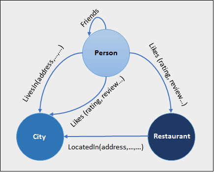
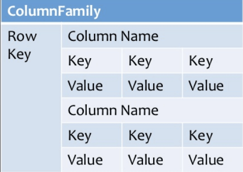

## 관계형 데이터베이스(relational database management system, RDBMS)

- 데이터를 행과 열로 구성된 테이블 형태로 구조화하는 데이터 베이스
- 테이블 간 기본키 또는 외래키 조인을 통해 다양한 관계를 설정할 수 있음
- sql 문으로 데이터들에 접근하여 CRUD 조작을 함
- 고정된 스키마(데이구조)를 가지고 있으며 데이터 베이스 설정시 미리 스키마 설정 필
- 트랜잭션(DB의 상태를 변화시키기 위한 수행 작업의 단위)과 트랜잭션의 속성 ACID를 사용하여 신뢰성을 높임
    - 원자성 (Atomicity) : 트랜잭션이 DB에 모두 반영이 되거나 전혀 반영되지 않아야 함
    - 일관성 (Consistency) : 트랜잭션 작업 처리 결과는 항상 일관성 있어야 함
    - 독립성 (Isolation) : 각각의 트랙잭션은 독립적이어야하고 서로 영향을 주지 않아야 함
    - 지속성 (Durability) : 트랜잭션 완료시 결과는 영구적으로 반영되어야 함

## NoSQL(Not Only SQL) 등장 배경

- 큰 규모의 데이터와 사용자를 대상으로 한 대용량 데이터의 읽기/쓰기 작업, 빠른 응답 시간, 높은 가용성을 필요로 하게 됨
- 관계형 데이터베이스는 정형 데이터를 주로 다루는데 비정형 데이터의 증가로 비정형 데이터를 효과적으로 저장하고 처리할 수 있는 데이터 베이스를 필요로 하게 됨
• 정형 정보 : 일반 데이터 베이스에서 지원되는 날짜, 숫자, 문자 등의 데이터
• 비정형 정보 : 멀티미디어, 이메일, 문서 등 정형 정보와 반대되는 개념

## NoSQL 특징과 RDBMS 와의 차이

- 기존 rdbms가 갖고 있는 특성 뿐만 아니라 다른 특성들도 지원하는 데이터 베이스
- 단순 검색 및 추가 작업에 있어서 매우 최적화된 키-값 저장 기법을 사용하여, 응답속도나, 처리 효율 등에 있어서 매우 뛰어난 성능을 나타냄
- 스키마와 테이블 간의 관계 정의하지 않아 테이블 간의 조인이 불가
- RDBMS는 수직적 확장(Scale-Up:더 성능이 좋은 서버를 사용)을 지원하지만  noSQL은 수직적 확장, 수평적 확장(Scale-Out:여러대의 서버를 사용) 모두 지원
- 실시간 데이터의 정확성 보다 가용성과 응답 속도를 우선시하여 때로는 데이터의 일관성이 떨어질 수 있음

## NoSQL 종류

- Key Value DB
    - 키를 고유한 식별자로 사용하는 키-값 페어의 컬렉션으로 데이터를 저장하며 키는 어떤 형태의 데이터라도 담을 수 있음
    - 대표적 : Redis, Riak..

   

- Document DB
    - 키-도큐먼트 형태로 저장
    - 대표적 : MongoDB

  

- Graph DB
    - 노드와 엣지를 사용하여 그래프 구조로 데이터를 표현하고 저장
    - 대표적 : Neo4J

- Column_family
    - rdbms와 같은 용어를 사용하나 컬럼들을 묶어 컬럼 패밀리를 만들 수 있음
    - 대표적 : HBase

  

  참조 : https://www.guru99.com/ko/nosql-tutorial.html,
  https://pythontoomuchinformation.tistory.com/528,
  https://www.ibm.com/kr-ko/topics/relational-databases,
  https://mommoo.tistory.com/62,
  https://velog.io/@wnguswn7/Database-RDBMS%EC%99%80-NoSQL%EC%9D%98-%EC%B0%A8%EC%9D%B4%EC%A0%90-%EC%95%8C%EC%95%84%EB%B3%B4%EA%B8%B0,
  https://kimkani.tistory.com/43,
  https://www.samsungsds.com/kr/insights/1232564_4627.html
