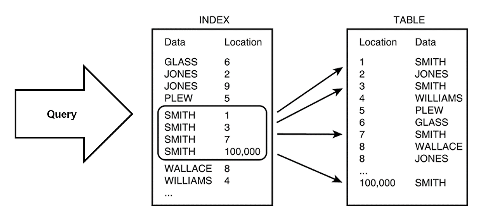

240521_cs면접대비스터디_인덱스(내부 구현, 장단점)

---

# 인덱스(index) 란?

추가적인 쓰기 작업과 저장 공간을 활용하여 데이터베이스 테이블에 저장된 데이터의 검색 속도를 향상시키기 위한 자료구조.

    `데이터베이스에 저장된 데이터의 위치 정보`



index에 key:value 형태로 해당 인덱스의 데이터 베이스의 위치정보를 저장해 두기 때문에 빠르게 데이테에 대한 읽기 작업을 할 수 있다.
<br>
<br>
<br>

# index를 쓰는 이유
- 조건을 만족하는 데이터(들)를 빠르게 조회하기 위해
- 빠르게 정렬(order by)하거나 그룹핑(group by)하기 위해

```sql
SELECT * FROM customer WHERE first_name = 'Garam';
DELETE FROM logs WHERE log_datetime < '2024-01-01';
UPDATE employee SET salary = salary*1.5 WHERE dept_id = 1001;
SELECT * FROM employee E JOIN department D ON E.dept_id = D.id;
```
- select, delete, update 시 `특정 조건` 을 만족하는 데이터를 빠르게 찾기 위해서 인덱스를 사용한다.


# 인덱스의 장단점
 
장점

검색 대상 레코드의 범위를 줄여 검색 속도를 빠르게 할 수 있다.
중복 데이터를 방지하거나 특정 컬럼의 유일성(Unique)을 보장할 수 있다.
ORDER BY 절과 GROUP BY 절, WHERE 절 등이 사용되는 작업이 더욱 효율적으로 처리된다.

 
단점

인덱스 생성에 따른 추가적인 저장 공간이 필요하다. (인덱스 사용 시 해당 정보를 담은 MYI 파일 생성)
CREATE(삽입), DELETE(삭제), UPDATE(수정) 작업 시에도 인덱스를 업데이트해야 하므로 성능 저하가 발생할 수 있다.
한 페이지를 동시에 수정할 수 있는 병행성이 줄어든다.
인덱스 생성 시간이 오래 걸릴 수 있다.
<br>
<br>
<br>

# 인덱스의 관리
인덱스는 항상 최신의 데이터를 정렬된 상태로 유지해야 원하는 값을 빠르게 탐색할 수 있다.
인덱스가 적용된 컬럼에 INSERT, UPDATE, DELETE가 수행된다면 계속 정렬이 일어나기 때문에 추가적인 오버헤드가 발생한다.
- INSERT: 새로운 데이터에 대한 인덱스를 추가
- DELETE: 삭제하는 데이터의 인덱스를 사용하지 않는다는 작업을 진행
- UPDATE: 기존의 인덱스를 사용하지 않음 처리하고, 갱신된 데이터에 대해 인덱스를 추가


인덱스는 데이터베이스에서 검색 및 처리하는 속도를 향상시키는 데 중요한 역할을 한다. 하지만, 인덱스를 적절하게 활용하지 않으면 오히려 데이터베이스의 성능이 저하되거나 저장 공간이 낭비될 수 있다.
따라서, 인덱스를 적절히 선택하고 생성하는 것이 중요하다.
<br>
<br>
<br>
 
# 인덱스를 사용하는 경우
1. 대량의 데이터를 검색하는 경우
대량의 데이터를 검색해야 하는 경우에는 인덱스를 사용하여 검색 속도를 향상시킬 수 있다. 대량의 데이터를 전체 스캔하는 것은 매우 느리고 부하가 발생하기 때문에 이 경우에 인덱스를 사용하여 검색하는 것이 효율적이다.
 
1. 정렬된 결과를 출력하는 경우
인덱스를 사용하여 데이터를 정렬하면 매우 빠르게 정렬된 결과를 출력할 수 있다. 따라서 데이터를 정렬하는 경우에는 인덱스를 사용하는 것이 좋다.
 
1. 조인 연산을 수행하는 경우
조인 연산을 수행하는 경우에는 인덱스를 사용하여 연산 속도를 향상시킬 수 있다. 인덱스를 생성하여 조인 대상 테이블의 데이터를 빠르게 검색하는 것이 좋다.
 
1. 유니크한 값을 가져오는 경우
인덱스는 유니크한 값을 가지고 있는 필드에 대해 중복되지 않는 값을 빠르게 검색할 수 있다. 이러한 경우 인덱스를 사용하여 검색 속도를 빠르게 할 수 있다.
 
1. 검색 빈도가 높은 경우
검색 빈도가 높은 필드에 대해서 인덱스를 생성하여 검색 속도를 향상시키는 것이 좋다.

