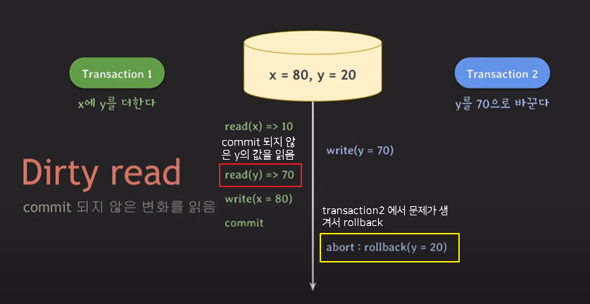
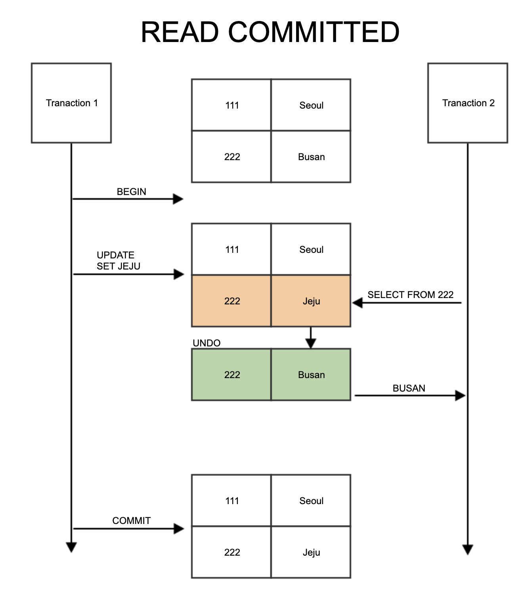

# 📌트랜잭션 격리 수준(Transaction Isolation Level)
여러 트랜잭션이 동시에 처리될 때, 특정 트랜잭션이 다른 트랜잭션에서 변경 하거나 조회하는 데이터를 볼 수 있게 허용할지 여부를 결정하는 것

isolation level이 높아질수록 트랜잭션간 고립정도가 높아지며, 성능 저하가 야기된다.

>격리수준 (저) READ UNCOMMITED - READ COMMITTED - REPEATABLE READ - SERIALIZABLE (고)

## 📌 isolation이 안 될 때 나타날 수 있는 이상현상

`Dirty Read` : 아직 commit 되지 않은 다른 트랜잭션의 데이터를 읽는 것

`Non-repeatable Read`
    다른 트랜잭션이 커밋한 데이터를 읽을 수 있는 것.
    한 트랜잭션에서 `같은 쿼리로 2번이상 조회`를 했을 때 `그 결과가 상이`한 상황
    보통 `데이터의 수정/삭제` 가 발생했을 때 발생한다.

`Phantom Read`
    다른 트랜잭션이 커밋한 데이터가 있더라도 자신의 트랜잭션에서 읽었던 내용만 사용하는 것.
    한 트랜잭션에서 `같은 쿼리를 2번이상 조회`했을 때 `없던 결과가 조회`되는 상황
    보통 `데이터의 삽입`이 발생했을 경우 발생
    방지하기 위해서 쓰기 잠금을 걸어야 한다.

> 이상 현상들이 모두 발생하지 않게 할 수 있지만 그러면 제약사항이 많이져서 동시 처리 가능한 트랜잭션 수가 줄어들어 결국 DB 전체 처리량(throughput)이 하락한다.
>
> 그렇기 때문에 일부 이상 현상은 허용하는 몇 가지 level을 만들어 사용자가 필요에 따라 적절하게 선택할 수 있도록 한 것 -> Isolation level

| Isolation level| DIRTY READ    | NON-REPEATABLE READ | PHANTOM READ  |
|------------------|:---------------:|:---------------:|:---------------:|
| READ UNCOMMITTED | O | O  | O |
| READ COMMITTED   | X | O  | O |
| REPEATABLE READ  | X | X  | O |
| SERIALIZABLE     | X | X  | X |

---

# 📌 격리수준(Isolation Level)

## Read Uncommitted (Level 0)
- `commit`이나 `rollback`에 상관없이 트랜잭션의 데이터 변경 내용을 다른 트랜잭션이 읽는 것을 허용한다. -> `Dirty Read` 발생
- **데이터 정합성에 문제가 생기는 격리 수준**
- RDBMS 표준에서는 격리수준으로 인정하지 않는다
- `SELECT`문이 실행되는 동안 해당 DATA에 Shared Lock이 걸리지 않는다.
  

> `Transaction A` 에서 데이터 변경이 commit 되지 않았지만 `Transaction B` 에서 변경된 데이터를 조회해서 사용 가능
>
> 데이터 정합성이 중요하다면 Read Uncomitted 

## READ COMMITTED (Level 1)
- 한 트랜잭션의 변경내용이 `commit` 되어야만 다른 트랜잭션에서 조회가 가능하다.
- 대부분의 RDBMS에서 `기본적으로 사용하는 격리수준`
- `SELECT`문이 실행되는 동안 Shared Lock이 걸린다.
- 조회시 실제 테이블 값이 아닌 `undo 영역에 백업된 레코드 값`을 가져온다.
- 하나의 트랜잭션에서 똑같은 SELECT 쿼리를 실행했을 때는 항상 같은 결과를 가져와야 하는 REPEATABLE READ의 정합성에 어긋난다.(`Non-repetable Read` 발생)
  

- READ COMMITTED 정합성 문제

## REPEATABLE READ (Level 2)
- 트랜잭션이 시작되기 전에 커밋된 내용에 대해서만 조회가 간으하다.
- MySQL 에서 기본으로 사용, `Non-repetable Read`가 발생하지 않는다.
- 트랜잭션이 완료될 때까지 select 문이 사용하는 모든 데이터에 shared Lock 이 걸리기 때문에 트랜잭션이 범위 내에서 조회한 데이터의 내용이 항상 동일함을 보장한다.
- 트랜잭션이 시작 시점 데이터의 일관성을 보장해야 하기 때문에 트랜잭션의 실행시간이 길어질수록 계속 `멀티 버전을 관리`해야 하는 단점이 발생한다.
- `Phantom read`가 발생할 수 있다.

## SERIALIZABLE (Level 3)
- 가장 엄격한 격리 수준이다
- 트랜잭션을 순차적으로 진행시킨다, 따라서 동시 처리 성능이 가장 떨어진다.
- 여러 트랜잭션이 동일한 레코드에 동시 접근할 수 없으므로 어떠한 데이터 부정합 문제도 발생하지 않는다.
- MySQL에서 순수한 SELECT 작업은 아무런 레코드 잠금 없이 실행되는데 SERIALIZABLE 격리 수준에서는 순수한 SELECT 작업에서도 대상 레코드에 넥스트 키 락을 읽기 잠금(공유락, Shared lock)으로 걸어 다른 트랜잭션에서 절대 추가/수정/삭제가 불가능 하다.
- SERIALIZABLE은 가장 안전하지만 가장 성능이 떨어지므로, 극단적으로 안전한 작업이 필요한 경우가 아니면 사용하지 않는다.

---

