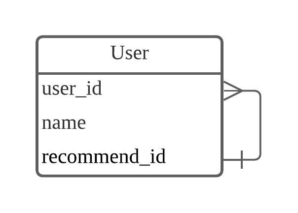

# 테이블 설계(Table Design)

## 정의

데이터베이스에서 특정 정보를 저장하고 관리하기 위한 구조를 정의하는 과정. 
여기서 말하는 구조라 함은, 단일 테이블에서의 컬럼과 필드 간 의존성, 복수의 테이블 간의 연관관계 등을 전부 일컫어 말한다.

기본적으로 테이블 설계를 수행해야 하는 이유는 결국 비용 때문이다. 리소스는 한정되어 있고, 조회에 있어 드는 인적, 물적 소모값은 추가 비용으로 환산되기 때문에 테이블 구조를 효율적으로 구성해야 비용 절감을 이끌어낸다.

---

## 설계 방법

설계에는 하향식 설계와 상향식 설계로 나뉜다.

>- 하향식 설계 : 세부사항을 먼저 구현 후, 전체 시스템으로 확장함
>- 상향식 설계 : 전체 시스템의 요구사항 파악 후,세부적인 부분 구현

하향식 설계는 현행 시스템이 없는 싱태에서 데이터 모델링을 수행할 때는 특히 다양한 자료의 수집이 요구된다. 엔티티가 도출되는 시점에서 관계 정의를 수행하게 된다.

상향식 설계의 경우에는, 보통 기획안을 토대로 모든 **키워드**가 도출된 후 각 키워드들 간의, 혹은 단일 키워드가 유발하는 **사건**을 분류한 후 키워드를 실체 엔티티에, 사건을 행위 엔티티에 대하여 매핑을 시키는 방향으로 나아갈 수 있다.

상향식 설계를 사용하기 좋을 경우는 업무 요구 사항이 거의 정리되고 문서화됐을 때이며 모델링 구현 시간이 단축된다. 다만 현행 업무와 데이터 구조가 그대로 시용될 기능성이 커진다.

---

## 관계 설정

두 테이블은 **일대일 관계**, **일대다 관계**, **다대다 관계**를 맺을 수 있다. 또한 하나의 테이블은 특별한 관계인 **자가 참조 관계**를 구성할 수 있다.

### 관계 설정하기
두 테이블이 어떤 관계를 갖는지 알기 위해서는 다음과 같은 질문을 던져볼 것.

>A 테이블과 B 테이블이 있다고 할 때, A 테이블의  단일 레코드가 B 테이블의 복수 레코드들과 연관될 수 있을까?

답이 하나라면 일대일 관계, 여러개라면 일대다 관계, 여러개이면서 그 역도 성립한다면 다대다 관계로 정해주면 된다.

### 일대일 관계

하나의 레코드가 다른 테이블의 레코드 한 개와 연결된 경우이다. 다음과 같이 `User` 테이블과 `Phonebook `테이블이 있다고 가정한다.

한 명의 사용자는 하나의 전화번호를 가질 수 있으며, 하나의 전화번호는 한 명의 사용자만을 가질 수 있기 때문에 위의 관계는 일대일 관계라고 할 수 있다.

### 일대다 관계

하나의 레코드가 서로 다른 여러 개의 레코드와 연결된 경우이다.

해당 구조에는 한 명의 사용자는 여러 개의 전화번호를 가질 수 있으나, 여러 명의 유저가 하나의 전화번호를 가질 수는 없는 구조이다.

일반적으로 데이터베이스를 사용할 때 가장 많이 사용되는 관계이다.

### 다대다 관계

여러 개의 레코드가 다른 테이블의 여러 개의 레코드와 관계가 있는 경우이다. 다대다 관계를 위해 스키마를 디자인할 때에는 `Join` 테이블, 즉 **중간 테이블**을 만들어 관리한다.

한 명의 고객은 여러 개의 여행 패키지를 구매할 수 있고, 여행 패키지 하나는 여러 명의 고객이 구매할 수 있다. 다만 다대다 관계 자체로 관리하면 관계가 맺어진 고객 단위와 여행 단위를 별도로 구별지어 관리하기 힘들기 때문에 위에서 언급한 중간 테이블을 활용하게 된다.

위처럼 중간 테이블을 생성해줌으로써, 특정 고객층과 특정 여행 종류가 어떤 관계를 보이고 추가 자료적인 활용 기대를 높일 수 있게 된다.

### 자가 참조 관계

때로는 하나의 테이블 내에서 관계를 표현해야 할 수도 있다. 예를 들어, 특정 서비스에서 회원 가입을 진행할 때, 추천인 ID를 입력하는 등의 기능에 사용된다.

위 테이블의 `recommend_id`는 같은 테이블의 `user_id`와 연결되어 있다.
한 명의 사용자 `user_id`는 한 명의 추천인 `recommend_id`을 가질 수 있다.
하지만 한 명의 추천인은 여러 명의 사용자에게 추천인으로 등록될 수 있다.
 

얼핏 들으면 일대다 관계와 매우 유사하지만, 같은 테이블 내에서 필드 정도로만 표현해도 될 지, 혹은 서로 다른 테이블의 관계를 나타내야만 할 지에 따라서 자가 참조 관계를 사용하거나 혹은 일대다 관계를 사용할 수 있다.