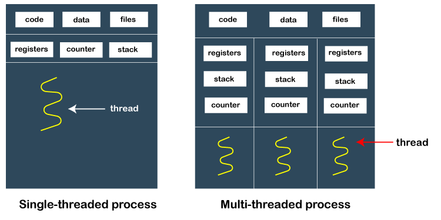

# 자바 비동기

## 1. 프로세스 & 스레드

<p align="center">

</p>

운영체제는 실행 중인 프로그램을 프로세스로 관리하게 된다. 프로세스란 간단하게 말해서 실행 중인 프로그램의 인스턴스다. 만약 여러 개의 작업을 수행하려면 여러 개의 프로세스를 생성해서 처리하게 되는데, 이 프로세스들을 멀티 프로세스라고 부른다.

각각의 프로세스 내부에는 개별적으로 단위화된 작업을 맡아서 처리하는 스레드가 존재하며, 하나의 프로세스가 두 가지 이상의 작업을 처리할 수도 있는데 이것은 그 프로세스 내부에 두 개 이상의 스레드가 존재하기 때문이다. 이런 여러 스레드를 멀티 스레드라고 부른다.

이 멀티 스레드는 스케줄러에 의해 독립적으로 관리된다. 자바에서 엄청 많이 보는 `main(String[] args)`, 즉 메인 메소드는 자바 프로그램의 시작점이자 종료점이 된다. 

메인 스레드에서 필요에 따라 추가 작업용 스레드를 생성해서 실행이 가능하다. 이 부분이 멀티 스레드 개념이자 자바의 비동기 개념의 시작점이 된다.

## 2. 자바의 병렬적 작업 처리

### 1) 스레드풀

스레드는 자바에서의 작업 단위를 칭하기도 한다. 작업의 병렬적 처리가 급증하면 당연히 스레드의 개수도 급증하게 된다. 다만 스레드가 폭증할 경우 그만큼 CPU에 걸리는 부담이 상당해지면서 메모리 사용량 역시 폭증하게 된다. 그렇게 되면 애플리케이션의 성능이 급격히 저하될 우려가 있다.

스레드풀은 작업 처리용 스레드를 제한된 개수만큼 정해두고, 작업용 큐(queue)에 들어오는 작업들을 스레드가 하나씩 맡아서 처리하는 방식이다. 큐에 존재하는 스레드의 작업 처리를 끝내고 다시 작업 큐에 새롭게 들어온 작업을 가져와 처리하면, 작업량이 증가해도 스레드 개수가 늘어나지 않으므로 애플리케이션 성능이 떨어지지 않는다.

자바에서는 스레드풀 생성을 위해 `ExecutorService` 인터페이스와 Executors 클래스를 제공한다. `Executors` 클래스의 정적 메소드를 이용하면 스레드풀인 `ExecutorService` 구현 객체를 만들 수 있다.

```java
ExecutorService executorService = Executors.newCachedThreadPool();
// 정적 메소드
// 초기 수 : 0
// 코어 수 : 0
// 최대 수 : Integer.MAX_VALUE
// 60초 동안 스레드 작업 안 할 시, 풀에서 제거

ExecutorService executorService = Executors.newFixedThreadPool(int nThreads);
// 정적 메소드
// 초기 수 : 0
// 코어 수 : 생성된 스레드 개수
// 최대 수 : nThreads
// 생성된 스레드 풀에서 별도 제거 안 함
```

`ExcutorService`를 구현함과 동시에 스레드들을 해당 작업처리 큐에 넣어주면서(즉, **작업 처리 요청**을 수행하면서) 병렬 작업이 수행된다. 작업 처리 요청과 관련해서 `ExcecutorService` 인터페이스는 `execute(Runnable command)` 메소드와 `submit(Callable<T> task)` 메소드를 제공한다.

```java
void execute(Runnable command)
// Runnable을 작업 큐에 저장
// 작업 처리 결과를 리턴하지 않음

Futrue<T> submit(Callable<T> task)
// Callable을 작업 큐에 저장
// 작업 처리 결과를 얻을 수 있도록 Future 리턴
```

### 2) 