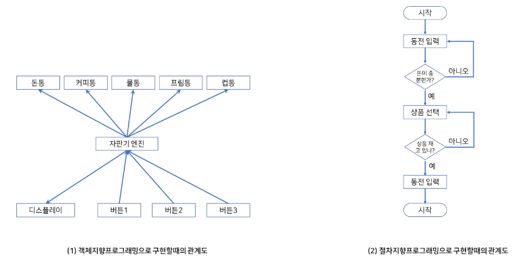
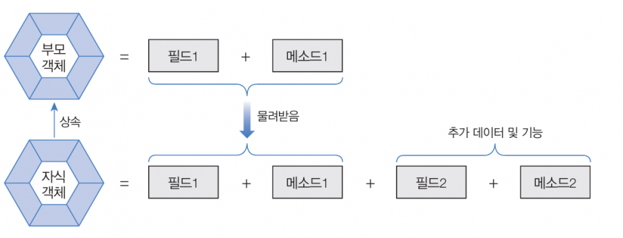
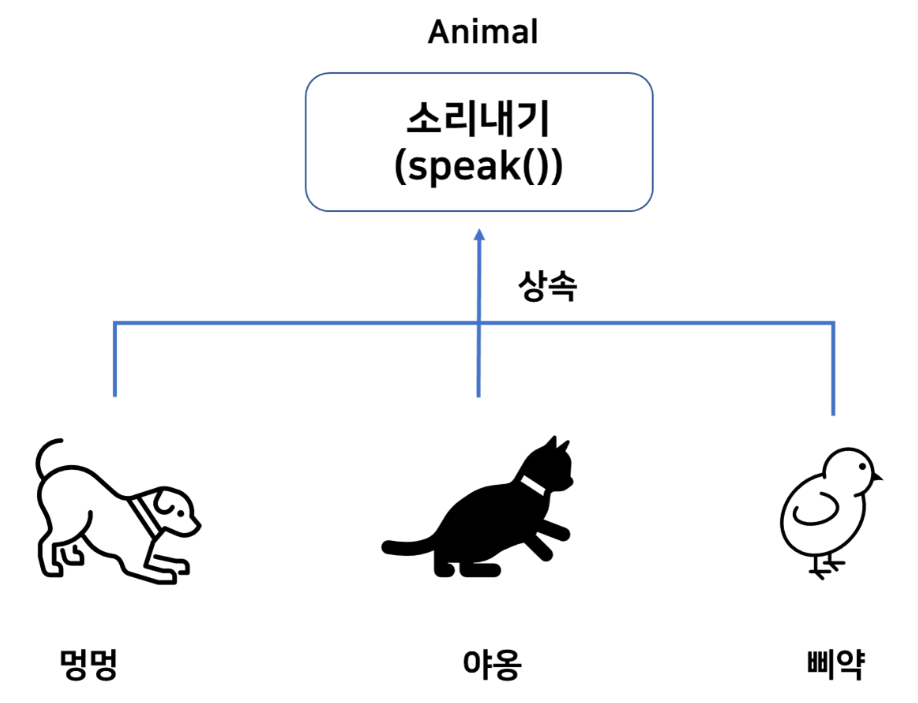

## 절차 지향 프로그래명 vs 객체 지향 프로그래밍

### ✅절차 지향 프로그래밍(Procedural Programming)
- 레시피를 따를는 것과 같이 프로그램을 여러 개의 순서대로 진행되는 절차(함수나 명령)들로 구성한다.
- 프로그램이 어떻게 실행되어야 하는지, 단계별로 무엇을 해야하는지를 중시.

### ✅객체 지향 프로그래밍(Object-Oriented Programming)
- 현실 세계에서 관찰할 수 있는 모든 객체는 자신만의 `속성`과 `기능`을 가지고 상호작용한다고 보고, 이와 같은 개념을 프로그램에 적용하여 여러가지 독립된 단위인 객체를 생성, 조작하여 `객체끼리 상호작용`할 수 있게하는 프로그래밍 방식.

#### ✅객체란?
- 물리적으로 존재하거나 개념적인 것 중 다른 것과 식별 가능한 것.
- 객체는 속성과 동작으로 구성된다. ex) 사람: 속성 - 이름,나이 | 동작 - 걷다, 웃다....

#### ✅객체의 상호작용
- 현실에서 일어나는 모든 현상은 객체와 객체간의 상호작용으로 이루어 진다.

- 객체지향 프로그램에서도 객체들은 다른 객체와 서로 상호작용하면서 동작한다.
- 객체가 다른 객체의 기능을 이용할 때 메소드를 호출한다. (객체들 사이의 상호작용 수단)

#### ✅객체 간의 관계

**집합 관계**
완성품과 부품의 관계
- ex) 자동차의 부품들

**사용 관계**
다른 객체의 필드를 읽고 변경하거나 메소드를 호출하는 관계.
- ex) 사람이 자동차에게 달린다, 멈춘다 등의 메소드 호출

**상속 관계**
부모 자식 관계
- 부모의 특징(필드, 메소드)를 물려받아 자식은 부모의 특징을 갖는다.

---

## ✅객체지향 프로그래밍의 특징
- 캡슐화(Encapsulation)
- 상속(Inheritance)
- 다형성(Polymorphism)
- 추상화(Abstraction)

### ✅ 캡슐화(Encapsulation)
- 서로 연관있는 속성과 기능들을 하나의 캡슐로 만들어 데이터를 외부로부터 보호하는 것
- 외부에서는 공개된 메소드를 통해 접근할 수 있다.

### ✅ 상속(Inheritance)
- 기존 클래스의 특성(필드와 메서드)을 새로운 클래스에서 이어받아 재사용 하는 것이다.(부모가 자식에게 상속해준다!)
- 두 클래스를 부모와 자식으로 관계를 맺어준다.
- 코드의 재사용성 상승 : 부모 객체의 필드와 메소드를 자식이 상속받아 사용하므로 중복 코딩을 줄인다.
- 유지 보수 시간을 줄여준다. : 부모 객체의 필드, 메소드를 수정하면 모든 자식 객체들도 수정된 필드, 메소드 사용 가능

### ✅ 다형성(Polymorphism)

- 하나의 객체가 여러가지 타입을 가질 수 있는 것.
- 부모 클래스 타입으로 자식 클래스 객체를 참조 할 수 있다.(자식 클래스 타입으로 부모 클래스 객체 참조 불가)
- 객체지향 프로그래밍의 유연성, 재활용성, 유지보수성의 기본
- 대표적으로 오버라이딩, 오버로딩이 있다.

>**오버라이딩 vs 오버로딩**
>`오버로딩(overloading)` : 기존에 없는 새로운 메서드를 정의하는 것(new) / 이름이 같은!
>`오버라이딩(overriding)` : 상속받은 메서드의 내용을 변경하는 것(change, modify)

### ✅ 추상화(Abstraction)
- 객체에서 공통된 속성과 행위를 추출하는 것
- 공통적인 특성을 파악하고 불필요한 특성을 제거하는 과정