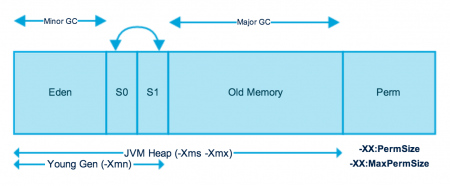
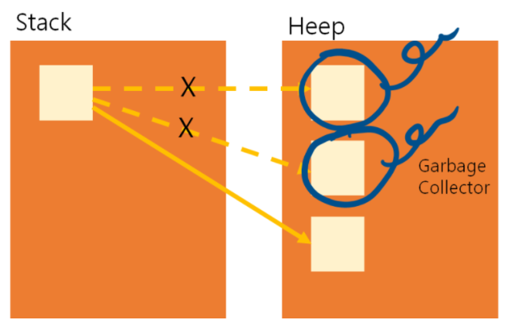
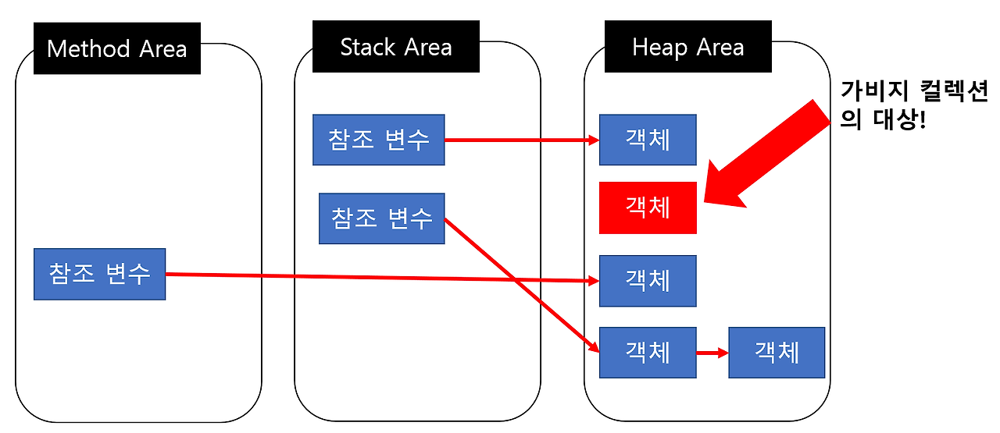
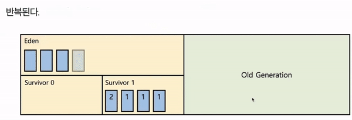
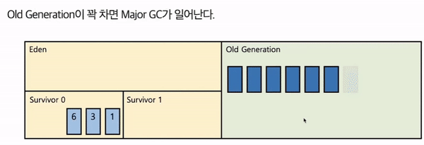
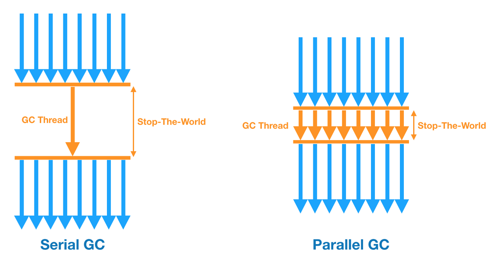
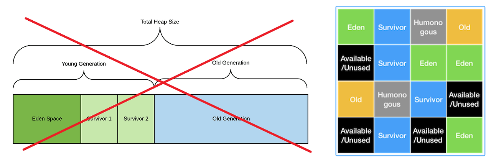
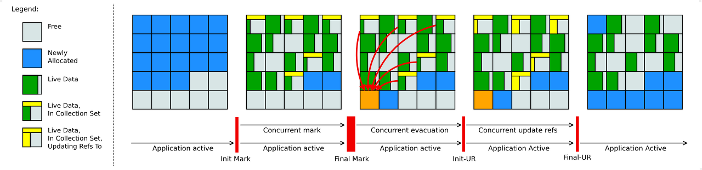
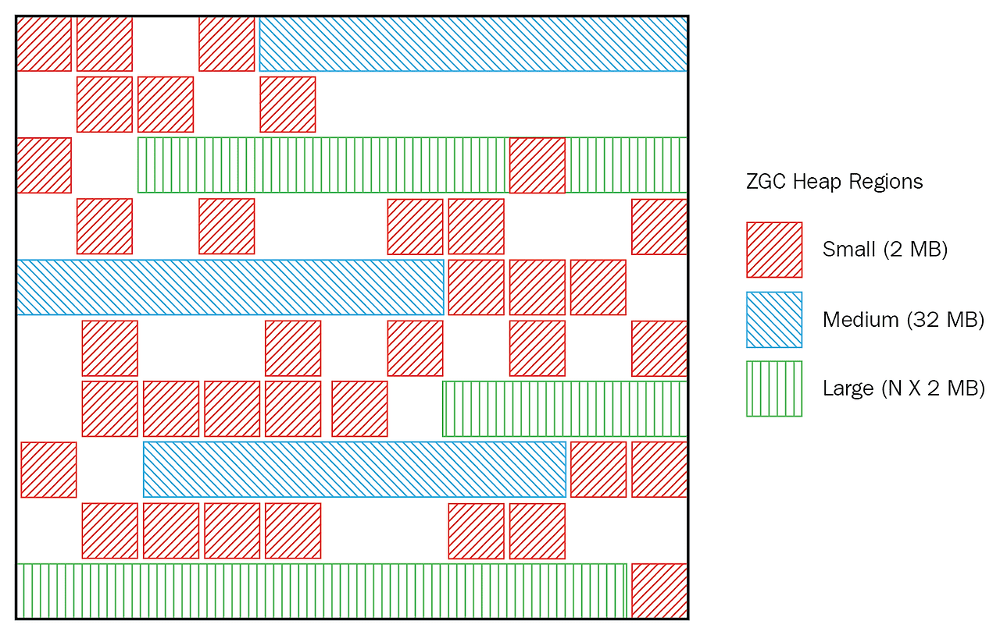

# 자바의 메모리 관리 및 GC

## 1. 자바의 메모리 관리

자바는 자동 메모리 관리 기능을 제공하기 때문에 개발자가 메모리의 할당과 해제를 직접 관리하지 않아도 되는 고급 언어에 속한다. 대표적인 예시가 후술할 자바의 **가비지 컬렉션(Garbage Collection)** 으로 참조되지 않는 객체를 자동으로 정리한다.

자바의 메모리 관리는 동적으로 할당된 객체가 저장되는 **힙(heap) 영역**과 메소드 호출 및 지역 변수 등을 저장하는 **스택(stack) 영역**으로 나뉘는데 이 중 힙의 메모리 설정과 관련된 옵션으로 **Xmx**와 **Xms**가 있다.

<p align="center">

</p>

### Xmx & Xms

우선 Xms는 초기 힙 메모리 크기를 지정하며, JVM이 시작될 때 할당하는 힙 메모리의 크기를 설정한다. Xmx는 최대 힙 메모리 크기를 지정하며, JVM이 앱 실행 중에 할당할 수 있는 최대 힙 메모리의 크기를 설정한다.

이 두 설정이 필요한 이유는 JVM이 기본적으로 메모리가 부족하게 되면 OS에 메모리를 추가 요청하는 방식으로 힙 사이즈를 조정하기 때문이다. 이때 GC가 발생하게 되고, JVM은 필요한 만큼 힙사이즈를 늘려가게 된다.

이렇게 조정하다가 만약 머신의 물리 메모리 사이즈를 넘어가게 되면 가상 메모리를 사용하면서 swap space로 swap in - out 을 하게 되고, 이는 추후 성능의 문제로 이어질 수 있다.

```java
java -Xms2048m -Xmx2048m -jar app.jar
```
위와 같은 명령어를 통해 `app.jar` 앱을 실행할 때, 초기 메모리 및 최대 메모리 설정을 직접 지정해줄 수 있다.

## 2. 가비지 컬렉션(GC)

<p align="center">

</p>


앞서 말했듯, GC는 JVM의 Heap 영역에서 동적으로 할당했던 메모리 중 필요 없게 된 메모리 객체(garbage)를 모아 주기적으로 제거하는 프로세스다.

여기서 더 이상 필요없는 객체의 예시는 아래와 같다.

```java
for (int i = 0; i < 10000; i++) {
  NewObject obj = new NewObject();  
  
  // 작업 실행...
}
```

반복문 내부의 `NewObject` 인스턴스들은 10000번 생성돼서 사용되나 반복문이 종료되면 쓸 일이 없이 메모리 공간만을 점유하게 된다. 이때, GC의 동작으로 해당 인스턴스가 점유하는 메모리를 정리하게 된다.

<p align="center">

</p>


GC의 대상이 되는 객체라 함은, **참조하지 않는 객체**라고 요약할 수 있다. 힙 영역에서 객체들이 실질적으로 생성되고 스택 영역 혹은 메소드 영역에서 해당 객체들의 참조 변수들이 생성된다. 이후 이벤트 종료로 참조 변수가 삭제돼서 붕뜬 객체들이 곧 참조하고 있지 않는 상태가 된다. 이것들이 곧 주기적인 GC 대상이다.

메모리를 자동적으로 정리해주는 점에서 개발자는 개발에만 집중할 수 있지만, 큰 단점이 존재한다. **바로 가비지 컬렉터가 언제 동작하는지 알 수 없다는 점이다.** 또한, 가비지 컬렉터가 동작하는 시점에 **다른 동작을 멈추기 떄문에 오버헤드 발생 가능성이 존재한다.***(전문 용어로 stop the world)

### GC 동작 방식

자바 힙메모리에는 객체의 생명주기를 기준으로 다양한 영역으로 나뉜다.

>- Old
>- Young
>    - Eden
>    - Survival 0
>    - Survival 1

Young 영역에서 발생하는 GC를 **Minor GC**, Old 영역에서 발생하는 GC를 **Major GC**라고 한다.

<p align="center">

</p>


기본적으로 GC는 **stop the world(기타 다른 동작들 전부 중단)** 를 일으키고, **mark and sweep(사용 여부 식별 및 메모리 해제)** 을 수행하는데, 처음 생성된 객체는 Young Generation 영역의 일부인 Eden 영역에 위치하다가 Eden이 꽉 차면 Minor GC가 발생한다.

여기서 살아남은 객체들은 Survival 영역으로 옮겨지고 해당 객체들의 생존값이 +1이 된다. Survival 영역이 두 개인 이유는 향후의 Minor GC가 발생했을 때, 그 대상이 되는 영역이 객체가 존재하는 Survival 영역도 포함되기 때문이다.

<p align="center">

</p>

O앞서 객체가 살아남을 때마다 생존값이 +1이 되고 이것이 임계값에 도달하면 Old 영역으로 옮겨지게 되고, Old 영역이 꽉 차면 Major GC가 발생한다.

Major GC는 데이터가 가득 차면 GC를 실행하는 단순한 방식이며, Old 영역이 상대적으로 큰 공간을 갖고 있기 때문에 GC 실행에 있어 Minor GC보다 많은 시간이 걸리고 이 부분에서 stop the world 문제가 발생할 수 있다.

### GC 알고리즘

위에서 언급한 시간 지연 문제를 해소하기 위한 다양한 알고리즘들이 개발되어 왔다.

<p align="center">

</p>

#### (1) Serial GC

서버의 CPU 코어가 1개일 때 사용하기 위해 개발된 가장 단순한 GC이며, GC를 처리하는 스레드가 싱글 스레드라서 stop the world 시간이 가장 길다.

Minor GC 에는 Mark-Sweep을 사용하고, Major GC에는 Mark-Sweep-Compact를 사용한다.
보통 실무에서 사용하는 경우는 없다. (디바이스 성능이 안좋아서 CPU 코어가 1개인 경우에만 사용) 

#### (2) Parallel GC 

Java 8의 디폴트 GC로, Serial GC와 기본적인 알고리즘은 같지만, **Young 영역의 Minor GC를 멀티 스레드로 수행한다.** (Old 영역은 여전히 싱글 쓰레드) Serial GC에 비해 stop the world 시간이 감소된다.

이것을 개선해서 Old 영역에서도 멀티 스레드로 GC를 수행하는 Parallel Old GC도 존재하며, 이를 위해 새로운 가비지 컬렉션 청소 방식인 **Mark-Summary-Compact** 방식을 이용한다.

#### (3) CMS GC (Concurrent Mark Sweep)

어플리케이션의 스레드와 GC 스레드가 동시에 실행되어 stop the world 시간을 최대한 줄이기 위해 고안된 GC지만 과정이 매우 복잡해지고 GC 대상을 파악하는 과정이 복잡한 여러단계로 수행되기 때문에 다른 GC 대비 CPU 사용량이 높으며, 메모리 파편화 문제로 인해 **Java 14부터 사용이 중지된다.**

#### (4) G1 GC (Garbage First)

<p align="center">

</p>

CMS GC를 대체하기 위해 jdk 7 버전에서 최초로 공개된 GC로,
Java 9+ 버전의 디폴트 GC로 지정됐으며 기존의 Young, Old 영역 개념이 아닌 **Region**이라는 개념을 도입해서 수행한다.

Region 개념은 전체 힙 영역을 Region이라는 영역으로 체스같이 분할하여 상황에 따라 Eden, Survivor, Old 등 역할을 고정이 아닌 동적으로 부여하는 개념이다.

#### (5) Shenandoah GC


<p align="center">

</p>

Java 12에서 공개됐으며 기존 CMS가 가진 단편화, G1이 가진 pause의 이슈를 해결하였다. 강력한 동시 처리성과 가벼운 GC 로직으로 힙 사이즈에 영향을 받지 않고 일정한 정지 시간이 소요되는 장점을 지녔다.

#### (6) ZGC (Z Garbage Collector)

<p align="center">

</p>

Java 15에 공개됐으며 대량의 메모리를 낮은 지연시간으로 처리하기 위해 디자인 된 GC다. 

G1의 Region 처럼 ZGC는 ZPage라는 영역을 사용하며, G1의 Region은 크기가 고정인데 비해, ZPage는 2mb 배수로 동적으로 운영됨. (큰 객체가 들어오면 2^ 로 영역을 구성해서 처리)

ZGC의 장점 중 하나는 힙 크기가 증가하더도 'stop-the-world'의 시간이 절대 10ms를 넘지 않는다는 것이다.