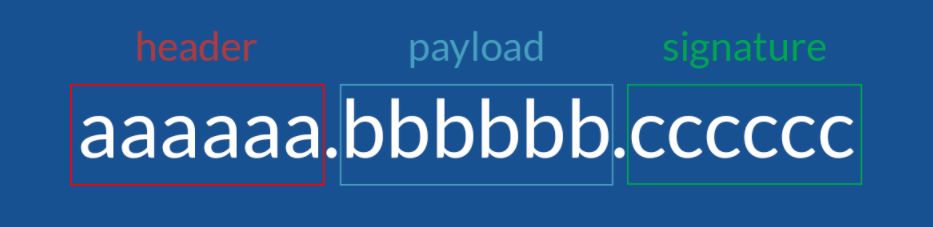
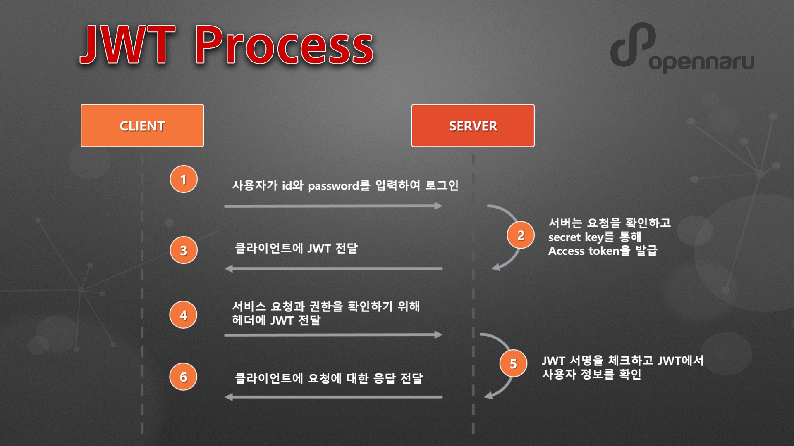

# JWT ( JSON WEB TOKEN )

## 1. 정의

JWT는 전자 서명 된 URL-safe (URL로 이용할 수있는 문자 만 구성된)의 JSON이며, 전자 서명은 JSON 의 변조를 체크할 수 있다.
JWT는 속성 정보 (Claim)를 JSON 데이터 구조로 표현한 토큰으로 RFC7519 표준 체계를 따르며, 서버와 클라이언트 간 정보를 주고 받을 때 Http 리퀘스트 헤더에 JSON 토큰을 넣은 후 서버는 별도의 인증 과정없이 헤더에 포함되어 있는 JWT 정보를 통해 인증하는 과정을 처리할 수 있다.
JWT는 HMAC 알고리즘을 사용하여 비밀키 또는 RSA를 이용한 Public Key/ Private Key 쌍으로 서명할 수 있다.

### (1) JWS (JSON WEB SIGNATURE) & JWE (JSON WEB ENCRYPTION)

JWT와 관련된 표준으로는 JSON Web Signature (JWS)는 JSON 데이터 구조를 사용하는 서명 표준으로 RFC7515이며, JSON Web Encryption (JWE)는 JSON 데이터 구조를 사용하는 암호화 방법으로 RFC7516 표준이 존재한다.

JWS (JSON Web Signature)은 **JSON으로 전자 서명을하여 URL-safe 문자열로 표현한 것**이며, 
JWE (JSON Web Encryption)는 **JSON을 암호화하여 URL-safe 문자열로 표현한 것**이다.

서명은 서명할 때 사용한 키를 사용하여 JSON이 손상되지 않았는지 확인 할 수 있도록 하는 것이며, 
URL Safe는 말 그대로 URL에 포함 할 수 없는 문자를 포함하지 않는 것을 뜻한다.

### (2) 토큰의 구성

JWT는 세 파트로 나누어지며, 각 파트는 점로 구분하여 표현된다. 순서대로 헤더 (Header), 페이로드 (Payload), 서명 (Sinature)로 구성된다.

Header는 토큰의 타입과 해시 암호화 알고리즘으로 구성되어 있습니다. 첫 번째는 토큰의 유형 (JWT)을 나타내고, 두 번째는 HMAC, SHA256 또는 RSA와 같은 해시 알고리즘을 나타내는 부분이다.

Payload는 토큰에 담을 클레임(claim) 정보를 포함하고 있습니다. Payload 에 담는 정보의 한 ‘조각’ 을 클레임이라고 부르고, 이는 name / value 의 한 쌍으로 이뤄져 있다. 토큰에는 여러 개의 클레임 들을 넣을 수 있다.

마지막으로 Signature는 secret key를 포함하여 암호화되어 있다.

### (3) JWT 처리 과정

1. 사용자가 id와 password를 입력하여 로그인을 시도한다.
2. 서버는 요청을 확인하고 secret key를 통해 Access token을 발급한다.
3. JWT 토큰을 클라이언트에 전달한다.
4. 클라이언트에서 API를 요청할때  클라이언트가 Authorization header에 Access token을 담아서 보낸다.
5. 서버는 JWT Signature를 체크하고 Payload로부터 사용자 정보를 확인해 데이터를 반환한다.
6. 클라이언트의 로그인 정보를 서버 메모리에 저장하지 않기 때문에 토큰기반 인증 메커니즘을 제공한다.

위의 과정은 일반적인 JWT 처리 과정이며, 서버 개발자의 커스터마이징에 따라 일부 차이가 있을 수 있다.

## 2. 세션 및 일반 토큰 기반과의 차이

JWT를 사용하는 가장 큰 이유는 클레임(Claim) 토큰 기반 인증이 주는 편리함이 가장 크다고 할 수 있다.

기존에 주로 사용하던 일반 토큰 기반 인증은 토큰을 검증할 때 필요한 관련 정보들을 서버에 저장해두고 있었기 때문에 항상 DB에 접근해야만 했었다. 또한 session 방식 역시 저장소에 저장해두었던 session ID를 찾아와 검증하는 절차를 가져 다소 번거롭게 느껴질 수 있다.

하지만 클레임 토큰 기반으로 이루어진 JWT(Json Web Token)는 사용자 인증에 필요한 모든 정보를 토큰 자체에 담고 있기 때문에 별도의 인증 저장소가 필요없다. 분산 마이크로 서비스 환경에서 중앙 집중식 인증 서버와 데이터베이스에 의존하지 않는 쉬운 인증을 제공하여 일반 토큰 기반 인증에 비해 편리하다고 말할 수 있다.