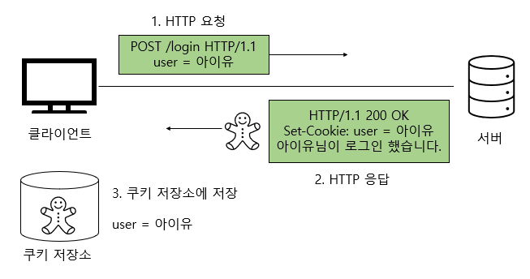

# 📌 쿠키와 세션

## 💡쿠키와 세션을 사용하는 이유
HTTP 프로토콜은 `비연결성(connectionless)`, `무상태(stateless)` 한 특성을 가지고 있기 때문에 `서버는 클라이언트가 누구인지 매번 확인`해야 한다.
이러한 특성이자 약점을 `보완하기 위해서 쿠키와 세션을 사용`한다.

✅ Connectionless
- 요청과 응답을 한번 주고받으면 바로 연결을 끊어버리는 특징
- 서버의 응답 이후에 연결을 종료하기때문에 서버 자원을 효율적으로 사용할 수 있다.

> 만약 요청&응답 이후에도 연결을 계속 유지한다면?<br>
> 서버는 `응답 이후에도 연결을 계속 유지`하기 때문에 `서버의 자원을 계속 소모`하게 된다!


✅ Connectionless의 한계

- TCP/IP `연결을 계속 새로 맺어야 한다` -> 3-way handshake 시간이 소요된다
- 사이트 요청 시 html, css, javascript, 이미지 등 많은 자원을 다운로드 → 자원마다 연결을 생성하기 때문에 overhead가 너무 크다


✅ HTTP 1.0 VS HTTP 1.1


>💡HTTP 1.1 버전은 connection을 계속 유지하는 keep-alive 옵션이 default, HTTP 1.0 은 default 가 connectionless.

<br>

✅ Stateless 

- 통신이 끝나면 상태를 유지하지 않는 특징
- 클라이언트와 서버의 통신이 끝나면 `서버는 클라이언트의 상태를 저장하지 않는다.`

장점 : 서버의 확장성이 높다 → 서버에 상태를 저장하지 않으므로 서버 확장이 용이하다.
단점 : 클라이언트가 데이터를 추가 전송해야 한다.

```
쿠키와 세션은 위 두 가지 특징을 해결하기 위해 사용.

💡 쿠키 & 세션을 사용하지 않는다면?
1. 쇼핑몰에서 옷을 구매하려고 로그인한다.
2. 페이지를 이동한다.
3. 응답을 받았기 때문에 연결이 끊기고, 서버는 클라이언트의 상태를 저장하지 않는다.(클라이언트가 누군지 알 수 없음)
4. 다시 재로그인을 해야한다.

💡 쿠키 & 세션을 사용한다면?
1. 쇼핑몰에서 로그인한다.
2. 해당 사용자에 대한 인증을 유지한다(쿠키 & 세션을 이용하여)
3. 한번의 로그인으로 인증을 유지할 수 있다!
```

---

## 🍪쿠키(Cookie)
**쿠키는 클라이언트(로컬)에 저장되는 키와 값이 들어있는 작은 데이터 파일**

    쿠키는 클라이언트에 저장되어 필요시 정보를 참조하거나 재사용 될 수 있다.

위에서 설명한 HTTP의 특성(connectionless, stateless) 때문에 쿠키가 사용된다.

**쿠키의 구성**
- 이름(Name) : 쿠키 구별 이름
- 값(Value) : 쿠키에 저장되는 값
- 유효시간(Expires) : 쿠키 유지시간
- 도메인(Domain) : 쿠키를 전송할 도메인
- 경로(Path) : 쿠키를 전송할 요청 경로

**💡쿠키의 특징**
- 클라이언트에 총 `300개의 쿠키를 저장`할 수 있다.
- 하나의 도메인 당 20개의 쿠키를 가질 수 잇다.
- 하나의 쿠키는 4KB까지 저장 가능하다

**💡쿠키의 동작 방식**

**쿠키 생성**

1. 클라이언트 서버에 로그인 요청
    서버 : 클라이언트의 정보를 담은 쿠키를 생성
2. HTTP 헤더에 쿠키를 포함 시켜 응답 (set-cookie 옵션)
3. 클라이언트는 응답에 포함된 쿠키를 쿠키 저장소에 저장.

**쿠키 생성 이후**


클라이언트가 로그인 이후 첫 페이지 welcome 페이지에 접근한다고 가정했을때.

1. 클라이언트 : 쿠키 저장소에서 쿠키 조회
2. 쿠키를 포함한 HTTP 요청 전송
    서버 : HTTP 요청의 쿠키를 읽어 클라이언트를 식별

**💡사용 예시**
1. 방문했던 사이트에 재 방문시 아이디 / 비밀번호 자동 입력
2. 팝업창을 통해 "오늘 이 창 다시 보지 않기" 체크

---

## 💽세션(Session)

일정 시간동안 같은 사용자(브라우저)로부터 들어오는 일련의 요구를 하나의 상태로 보고, 그 상태를 일정하게 유지시키는 기술.<br>

    일정시간 : 방문자가 웹 브라우저를 통해 웹 서버에 접속한 시점으로부터 웹 브라우저를 종료하여 연결을 끝내는 시점

**방문자가 웹 서버에 접속해 있는 상태를 하나의 단위로 보고 그것을 세션 이라고 한다.**

세션은 쿠키를 기반으로 하지만 `쿠키와 다르게 서버 측에서 저장하고 관리`한다.


**💡세션의 특징**
- `웹 서버에` 웹 컨테이너의 `상태를 유지하기 위한 정보를 저장`한다.
- 웹 서버의 저장되는 쿠키(=세션 쿠키)
- 브라우저를 닫거나, 서버에 세션을 삭제했을때만 삭제가 된다 -> `쿠키보다 비교적 보안이 좋다.`
- 저장 데이터에 제한이 없다.(서버 용량이 허용하는 한)
- 각 클라이언트에 고유의 session ID를 부여한다.

**💡세션의 동작 방식**

1. 클라이언트의 로그인 요청
2. 서버에서 클라이언트의 정보를 담은 세션 생성 - sessionId 담은 쿠키 생성
3. HTTP 헤더에 쿠키를 포함 시켜 응답 (set-cookie 옵션)
4. 클라이언트는 응답에 포함된 쿠키를 쿠키 저장소에 저장.


클라이언트가 로그인 이후 첫 페이지 welcome 페이지에 접근한다고 가정했을때.

1. 클라이언트 : 쿠키 저장소에서 쿠키 조회
2. 쿠키를 포함한 HTTP 요청 전송
3. HTTP 요청의 쿠키 조회 - 쿠키 안의 세션 ID 조회(클라이언트 식별)

**💡사용 예시**
- 로그인 같이 보안상 중요한 작업의 수행

---

## 🧐쿠키와 세션의 차이
| **null**     | **쿠키(Cookie)**                                 | **세션(Session)**     |
|--------------|------------------------------------------------|---------------------|
| 저장 위치        | 클라이언트(=접속자 PC)                                 | 웹 서버                |
| 저장 형식        | text                                           | Object              |
| 만료 시점        | 쿠키 저장시 설정(브라우저가 종료되도, 만료시점이 지나지 않으면 자동삭제되지 않음) | 브라우저 종료시 삭제(기간 지정 가능)      |
| 사용하는 자원(리소스) | 클라이언트                                          | 웹 서버                |
| 용량제한         | 총 300개 <br> 하나의 도메인 당 20개 <br> 하나의 쿠키 당 4KB(=4096byte)     | 서버가 허용하는 한 용량제한 없음. |
| 속도           | 세션보다 빠름                                        | 쿠키보다 느림             |

- 쿠키는 클라이언트에 저장되지만, 세션은 서버에 저장된다.
- 세션은 서버에 저장되므로 서버의 자원을 사용한다.
- 반면 쿠키는 클라이언트에 저장되므로 서버의 자원을 사용하지 않는다는 이점이 있다.
- 서버에 요청을 보내는 사용자가 많을 경우 세션은 부하가 심할 수 있다.
- 보안면에서 세션이 더 우수하다. 쿠키는 정보를 직접 저장하고 요청을 보낼 수 있다. 만약 쿠키에 사용자의 주민번호 같은 민감한 정보를 그대로 담아 HTTP 요청을 보낸다고 하자. 이때 중간에 정보를 스니핑 당할 수도 있다.
- 세션은 쿠키를 이용해 쿠키에 세션 ID만 저장하고 서버에서 세션을 처리하기 때문에 비교적 보안성이 좋다.
- 쿠키는 만료시간 동안 파일로 저장되므로 브라우저를 종료해도 정보가 남아있다.
- 세션은 브라우저가 종료되면 만료시간에 상관없이 삭제된다.