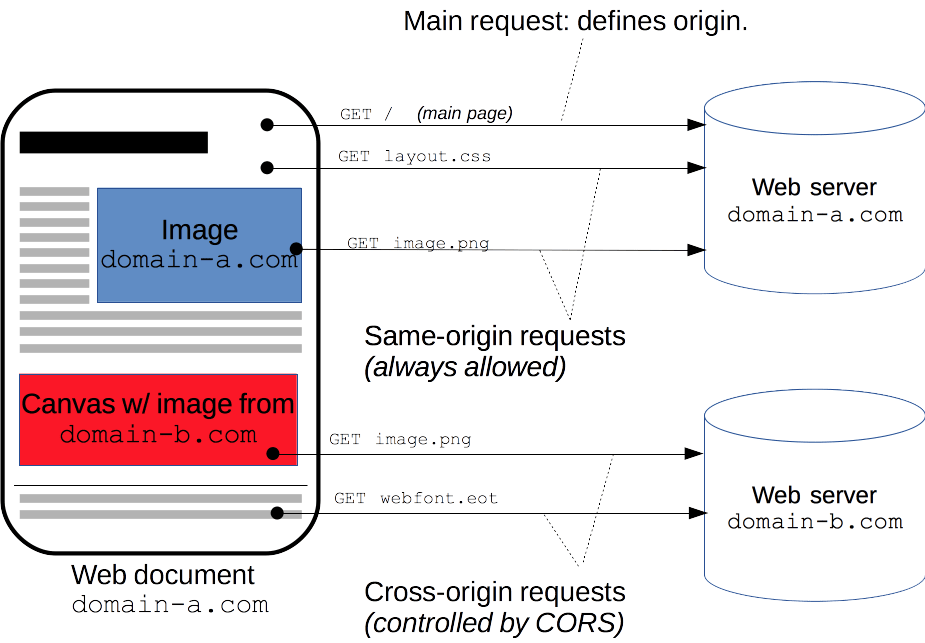
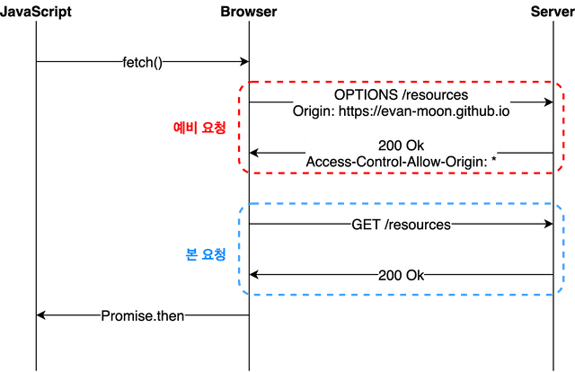

# 📌CORS(Cross-Origin Resource Sharing)

## 📖사전 개념
### 1. Origin(출처)

`URL`에서 확인 가능한 `프로토콜`,`호스트`,`포트`가 같을 때 같은 출처

>`localhost`와 `127.0.0.1`은 실제로 같은 주소지만 다른 호스트로 판단된다.

### 2. SOP(Same Origin Policy)

#### ✅ 정의
웹 브라우저 보안을 위해 **Same-Origin(프로토콜, 호스트, 포트가 같은)의 서버로만 리소스를 주고 받도록** 상호작용을 제한하는 보안 방식.


#### ✅ SOP 사용이유
A 사이트 로그인 후 해커 링크 클릭 시
-> 해커가 송금 등 민감 정보를 가져올 수 있다
`SOP`를 이용하면 `Origin`이 다르기 때문에 요청을 거절한다.
-> 원래 `asite.com` 에서 요청이 와야한다면, 해커는 `hacker.ck` 에서 요청을 보낸다.

---

## ✨CORS
교차 출처 리소스 공유(Cross-Origin Resource Sharing)

### 💡정의
`다른 Origin(출처)으로 들어오는 요청을 허용`해주는 것

추가 HTTP 헤더를 사용하여, **한 출처에서 실행 중인 웹 애플리케이션이 다른 출처의 선택한 자원에 접근할 수 있는 권한을 부여**하도록 브라우저에 알려주는 체제.

### 💡접근 제어 시나리오
#### ✅Simple Request
>**사전요청(Preflight)없이** 바로 요청을 날린다.

**필요조건**
1. `GET`,`POST`,`HEAD` 메서드 중 하나여야 한다.
2. 헤더는 다음만 허용된다.
   - Accept
   - Accept-Language
   - Content-Language
   - Content-Type   
3. WebKit / Safari 브라우저
   - 헤더 중 하나에 `nonstandard` 값이 존재하면 더 이상 요청을 `simple request`로 간주하지 않는다 
4. `POST` 메서드의 경우, `Content-Type`이 다음 중 하나여야 한다.
   - application/x-www-form-urlencoded
   - multipart/form-data
   - text/plain

#### ✅ Preflight Request

본 요청을 보내기 전, 요청을 보내도 되는지 `Options` 메소드를 통해 확인

1. 사전 요청(preflight request)으로 이 요청을 보내도 되는지 물어본다. 헤더에 다음 행목이 포함 되어야 한다.

```
"Origin" : 해당 위치에서 요청을 보낸다는 뜻
"Access-Control-Request-Method" : 어떤 메소드의 요청을 보낼건지 물어봄
"Access-Control-Request-Headers" : 실제 요청에 추가 헤더를 무엇을 보낼 수 있는지 물어봄
```

2. 보내도 된다는 사전 응답(preflight response)을 받는다. 헤더에 다음 항목이 포함 되어야 한다.
- 응답 바디는 비어있어야 한다.
- 응답 코드는 `2xx`여야한다.

```
"Access-Control-Allow-Origin" : 해당 `Origin`을 허가한다는 뜻
"Access-Control-Allow-Methods" : 해당 `메소드`들의 요청을 허가한다는 뜻
"Access-Control-Allow-Headers" : 해당 `헤더`들을 허가한다는 뜻
"Access-Control-Max-Age" : 응답의 `캐시` 기간, 해당 캐시가 있을시 preflight 과정을 건너뜀
```

3. 실제 요청을 보낸다.
4. 실제 응답을 받는다.

#### ✅Credentialed Request
**자격증명(쿠키, authorization, 인증서..)를 포함하는 요청**<br><br>

사전 요청을 보낼때 사전 요청-응답 헤더 필드가 추가된다.


1. 사전 요청(preflight)로 이 요청을 보내도 되는지 물어봄. 이때 헤더에 다음 항목이 포함되어야 함
```
"Origin" : 해당 위치에서 요청을 보낸다는 뜻
"credentials : include" : 자격증명 정보가 포함된다는 뜻
자격증명 정보 : 헤더나 쿠키 등
```
2. 보내도 된다는 응답을 받음. 이때 헤더에 다음 항목이 포함되어야 함
```
"Access-Control-Allow-Origin" : 해당 `Origin`을 허가한다는 뜻
"Access-Control-Allow-Credentials: true" : 자격증명을 허가한다는 뜻
```
3. 실제 요청을 보낸다
4. 실제 응답을 받는다

> **자격증명 요청의 응답 주의사항**<br>
> - 서버는 `Access-Control-Allow-Origin` 헤더값에 `"*"` 와일드카드를 지정할 수 없고, 반드시 출처를 지정해야 한다.

#### ✅추가 헤더
**`Access-Control-Expose-Headers : 웹 브라우저의 클라이언트 스크립트에 노출될 헤더를 결정**


