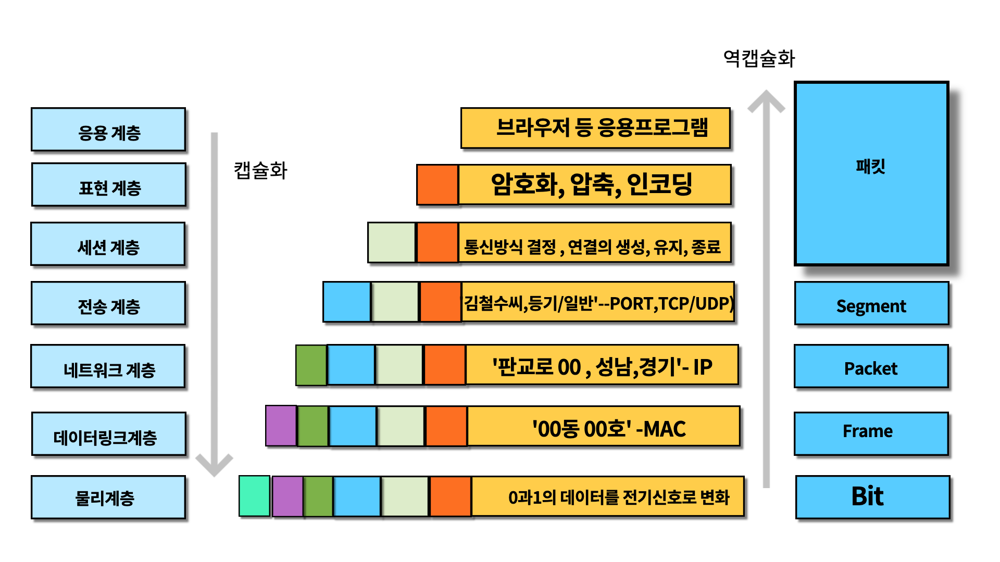
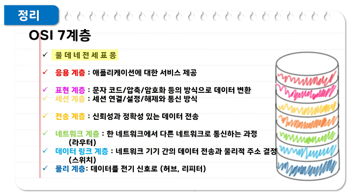

# 📌 OSI 7계층
- 국제표준화기구(ISO)에서 개발한 모델, `네트워크 통신이 일어나는 과정을 7단계로 나눈 것.`
- 계층별 기능과 통신 과정을 단계별로 나누어 쉽게 알 수 있다.
- 특정 계층에 이상이 생긴다면 해당 계층만 수정해 문제를 해결할 수 있다.
 
 

- 각 레이어에 맞게 프로토콜이 세분화돼서 구현
- 각 레이어의 프로토콜은 하위 레이어의 프로토콜이 제공하는 기능을 사용하여 동작한다.

### 💡7. 응용 계층(Application layer)
- 애플리케이션 `목적에 맞는 통신 방법 제공`
- ex) HTTP, DNS, SMTP, FTP(대표적인 프로토콜)

### 💡6. 표현 계층(Presentation layer)
- 애플리케이션 간의 통신에서 메시지 포맷 관리
- 전송하는 `데이터의 표현방식` 결정
- 인코딩 <-> 디코딩 / 암호화 <-> 복호화 / 압축 <-> 압축 풀기
- ex) GIF, JPEG, ASCII 등

### 💡5. 세션 계층(Session layer)
- 애플리케이션 간의 통신에서 세션을 관리 - 세션의 생성, 유지, 종료를 관리!
- ex) `SSH`, `TLS`, `RPC`(remote procedure call)

### 💡4. 전송 계층(Transport layer)
- 애플리케이션 간의 통신 담당, 목적지로 데이터 전송
- `포트번호를 정하는 계층`
- ex) 안정적이고 신뢰할 수 있는 데이터 전송 보장(TCP)_세그먼트(Segment) / 필수 기능만 제공(UDP)_데이터그램(Datagram)

### 💡3. 네트워크 계층(Network Layer)
- 경로(Route)와 주소(IP)를 정하고 패킷을 전달
- 목적지 호스트로 데이터 전송
- 네트워크 간의 `최적의 경로 결정`

### 💡2. 데이터 링크 계층(Data link Layer)
- `네트워크 기기간의 데이터 전송`
- 물리 주소 결정
- MAC 주소 기반 통신

- 전송단위 : 프레임(Frane)
- 장비 : 브릿지, 스위치, 이더넷

### 💡1. 물리 계층(Physical layer)
- 데이터를 전기신호로 변경하여 전송한다
- `bits` 단위의 데이터 전송

- 전송단위 : 비트(Bit)
- 장비 : 케이블, 허브

---

