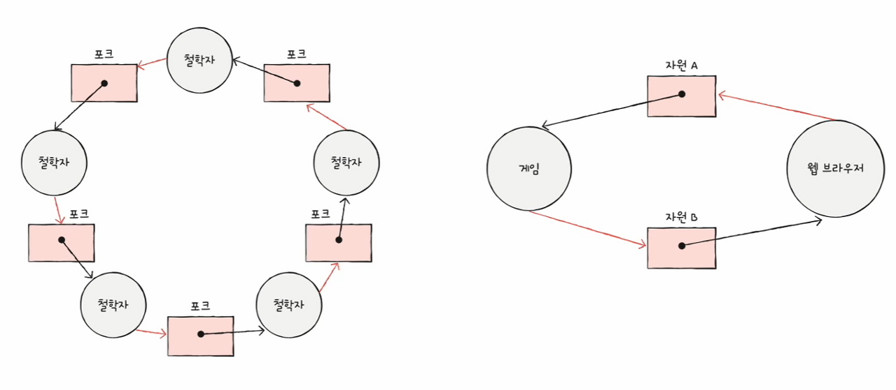

# 데드락(Deadlock)

## 정의

사전적 의미는 교착 상태, 둘 이상의 프로세스가 다른 프로세스가 점유하고 있는 자원을 서로 기다릴 때 무한 대기에 빠지는 상황을 뜻함.

## 원인

**특정 프로세스는 특정 자원을 할당받아서 사용 중**이고,**또다른 특정 프로세스는 다른 특정 자원을 할당받기를 대기하는 중**이다.

위의 그림처럼 자원 할당 개요가 원형을 이룰 때 발생한다.
대표적인 원인은 아래 4가지가 있다.

>- 상호 배제 
>한 프로세스가 사용하는 자원을 다른 프로세스가 사용할 수 없는 상태
>- 점유와 대기 
자원을 할당받은 상태에서 다른 자원을 할당 받기를 기다리는 상태
>- 비선점 
어떤 프로세스도 다른 프로세스의 자원을 강제로 빼앗지 못하는 상태
> - 원형 대기 
프로세스들이 원의 형태로 자원을 대기하는 상태

## 해결 방법

### 1. 예방

4가지 원인들에 대하여 우선적으로 배제한다. 단, 각각의 우선적 배제는 부작용이 따르게 된다.

#### 상호 배제 예방

모든 자원을 프로세스가 동시 공유할 수 없기 때문에 **현실적으로 불가능**하다.

#### 점유와 대기 예방

특정 프로세스에 모든 자원을 할당하거나 배제하는 방식을 취하게 되지만, **자원의 활용률이 낮아지게 된다**.

#### 비선점 예방

CPU처럼 선점 가능한 자원이 있지만, **모든 자원이 선점 가능한 경우는 아니기 때문에** 효과적이지 않음.

#### 원형 대기 조건

**자원에 대하여 오름차순 배열**을 수행하면 효과적이나, **기준에 따라 자원 활용률이 다르게 된다**.

### 2. 회피

회피의 전제 조건은 **자원의 무분별한 할당으로 인한 교착**이 발생한 경우다. 즉, 자원의 효과적 배분을 고려해서 교착 상태를 회피하는 것이 핵심 골자가 된다.

#### 안전 순서열

교착 상태 없이 안전하게 모든 프로세스들에 자원을 할당할 수 있게하는 순서를 뜻한다. 교착 상태의 발생 가능성 없이 프로세스의 자원 할당 및 종료 과정이 안전하게 이뤄지려면 안전 순서열을 구축해야 하는데, 이와 관련된 알고리즘으로 **은행원 알고리즘**이 있다.