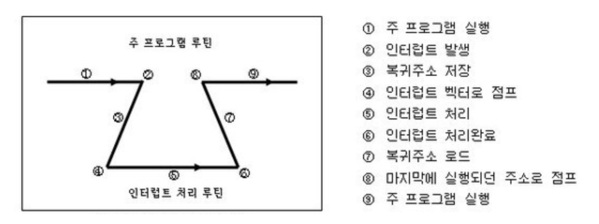
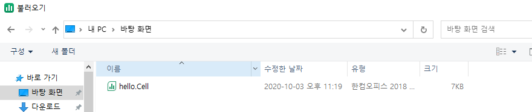
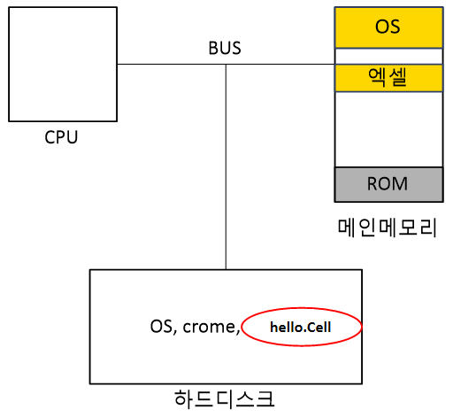

# 인터럽트(Interrupt)

## 정의

입출력 하드웨어 장치 등의 프로세스 실행 도중 예기치 않은 상황이 발생할 때 발생한 상황을 처리한 후 실행 중인 작업으로 복귀하는 것을 말한다.

### 키워드 정리
>- 인터럽터 서비스 루틴 : 실제 인터럽트를 처리하기 위한 루틴. **인터럽트 핸들러**라고도 하며, 운영체제의 코드 영역에는 인터럽트별로 처리해야할 내용이 이미 프로그램되어 있다.
>
>- 인터럽트 벡터 : 인터럽드 발생시 처리해야 할 인터럽트 핸들러의 주소를 인터럽트 별로 보관하고 있는 테이블.

---

## 인터럽터 서비스 루틴

### 1. 주 프로그램 작업 수행 중 인터럽트 발생

CPU는 정해진 흐름에 따라 명령어를 처리해 나가지만 간혹 이 흐름이 끊어지는 상황이 발생한다. 이를 인터럽트라고 한다.

>- 하드웨어 인터럽트 : CPU가 아닌 다른 하드웨어 장치가 cpu에 어떤 사실을 알려주거나 cpu 서비스를 요청해야 할 경우 발생한다.
>
>- 소프트웨어 인터럽트 : 소프트웨어(사용자 프로그램)가 스스로 인터럽트 라인을 세팅한다. 인터럽트를 발생시키기 위해 하드웨어/소프트웨어는 cpu내에 있는 인터럽트 라인을 세팅하여 인터럽트를 발생

### 2. 주 프로그램 상태 레지스터와 PC 등을 스택에 잠시 저장

인터럽트가 종료되고 난 이후의 원래 해당 작업으로 복귀하기 위한 기억 목적으로 저장한다.

### 3. 인터럽트 서비스 루틴으로 점프, 처리

운영체제(OS) 안의 **마우스에 관한 전기신호를 받으면 어떤 동작을 할지 정해져있는 코드**, **하드디스크에서 파일을 찾아오는 코드** 등 인터럽트가 발생하면 어떻게 할지 정해져있는 OS 안의 코드들을 **인터럽트 서비스 루틴(Interrupt Service Routine)** 이라고 한다. 그리고 이렇게 인터럽트가 걸리고 처리하는 과정을 통틀어 **인터럽트 서비스(Interrupt Service)** 라고 한다.

위의 그림처럼, 바탕화면에서 엑셀 파일 하나를 가져오려는 작업을 수행하려고 한다.

하드디스크에 저장된 `hello.Cell`이라는 파일을 찾아 읽어와 띄워야하는데, 하드디스크를 읽어오는 코드는 운영체제 안에 존재한다. 이 시점에서 메인 메모리상에 올라가있는 엑셀에서 소프트웨어 인터럽트를 건다. 그렇게 되면 OS의 하드디스크를 찾는 코드가 실행되고, `hello.Cell`을 읽어오게 된다.

이상의 과정이 소프트웨어 인터럽트의 과정 모식이다.

### 4. 다시 메인 프로그램 작업 복귀

인터럽트 과정이 해제되면 다시 메인 프로그램의 작업으로 복귀하게 된다.

---

## 대비 개념 : 폴링

폴링은 주기적으로 CPU가 상태를 파악하기 위해 장치의 레지스터를 읽어야 한다. 이 작업이 진행되는 동안은 다른 장치는 체크가 힘들다. 그리고 이런 작업은 장치의 상태를 읽는데 CPU의 자원이 낭비된다

폴링이 대상을 주기적으로 감시하여 상황이 발생하면 해당처리 루틴을 실행해 처리한다면, 인터럽트는 상대가 CPU에게 일을 처리해 달라고 요청하는 수단이다. 따라서 폴링과 대비되는 개념이다

CPU의 다른일과 겹쳐 폴링이 빠른 하드웨어에서 데이터가 손실될 여지가 있다면, 인터럽트는 해당 하드웨어가 CPU에게 요청하므로 빨리만 처리된다면 데이터 손실 위험이 작아진다.