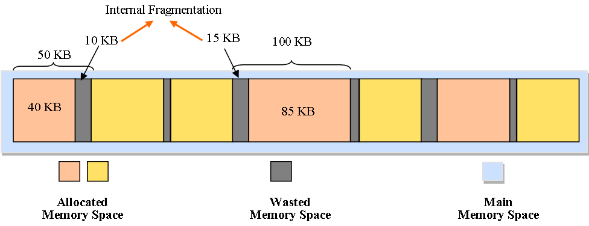
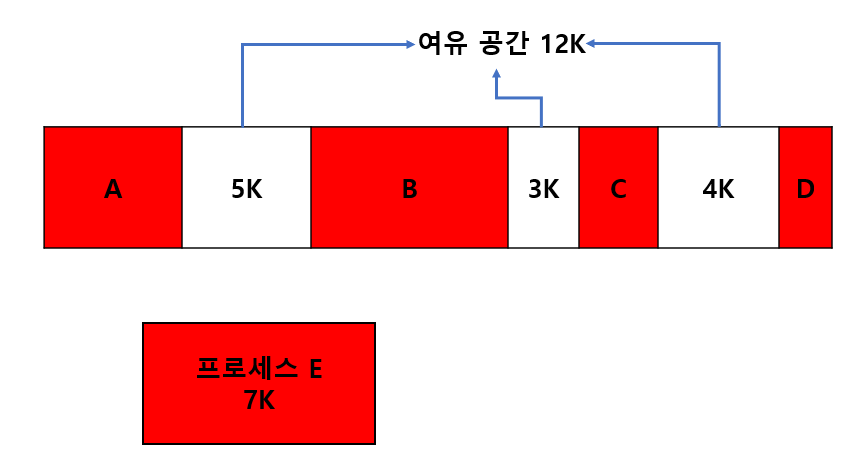
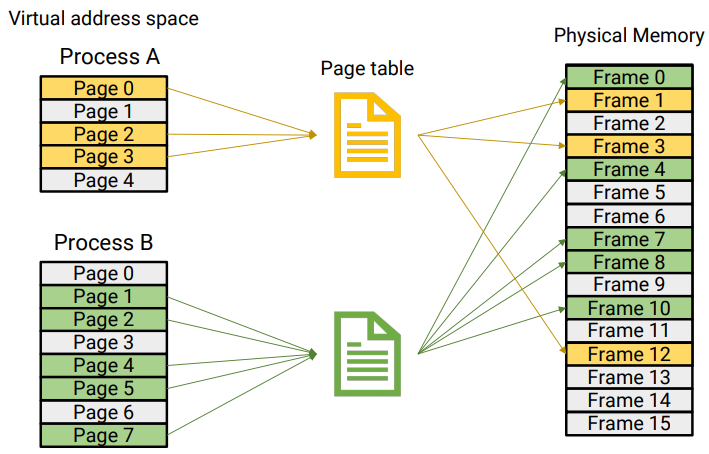
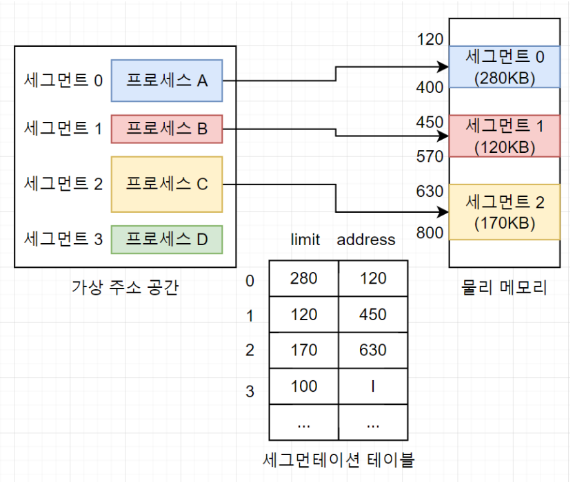
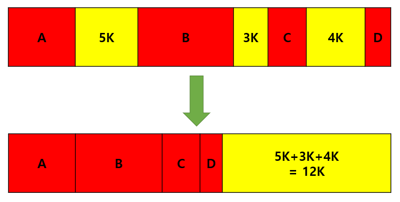
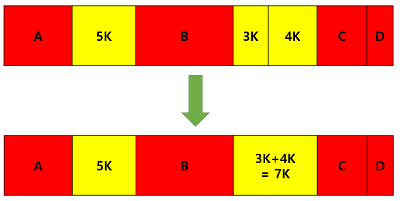

# 📌메모리 단편화(Memory Fragmentation)
> RAM에서  메모리의 공간이 작은 조각으로 나뉘어져 충분히 사용 가능한 메모리가 있음에도 시스템이 메모리 할당을 할 수 없는 상태

메모리 단편화가 발생하는 원인에 따라 `내부 단편화`와 `외부 단편화`로 구분 할 수 있다.

## 📌내부 단편화(Internal Fragmentation)

- 메모리를 할당할 때 `프로세스가 필요한 양보다 더 큰 메모리가 할당`되어 `메모리 공간이 낭비`되는 상황
- 위 그림과 같이 50KB를 할당 받은 프로세스가 40KB 밖에 사용하지 않는다면 10KB만큼의 내부 단편화가 발생

## 📌외부 단편화(External Fragmentation)

- 메모리가 할당되고 해제되는 작업이 반복될 때, 작은 메모리가 중간중간 생겨난다. 이러한 메모리 공간들이 많아지면서 `총 사용 가능한 메모리 공간은 충분하지만 실제로 할당할 수 없는 상황`
- 남은 공간은 12K이나 프로세스 E를 분할하여 넣을 수 없으므로 할당할 수 없다.

## 📌메모리 단편화를 해결하기 위한 메모리 관리 방법
### 페이징 기법 (Paging)
- 가상 메모리 사용, 외부 단편화 해결, 내부 단편화 존재

- 고정 분할 방식을 이용한 가상 메모리 관리 기법, 물리 주소 공간을 같은 키기의 메모리 영역으로 나누어 사용한다.
- 가상 주소는 프로세스 입장에서 바라본 메모리 공간으로 항상 0번지부터 시작
- 물리 메모리 단위로 가상 메모리를 할당하기 때문에 페이지 크기와 프레임 크기는 같다.
  - 페이지 : 가상 주소의 분할된 각 영역
  - 프레임 : 물리 메모리의 각 영역
  - page mapping : 페이지와 프레임을 대응 시키는 과정, 이를 위해 paging table이 있다
- 연속적이지 않은 공간도 활용할 수 있기 때문에 외부 단편화 문제를 해결할 수 있다
- 페이지 단위에 알맞게 꽉채워 쓰는게 아니므로 내부 단편화 문제는 여전히 있다.(페이지 단위를 작게하면 내부 단편화 문제도 해결할 수 있지만 PAGE MAPPING 과정이 많아지므로 오히려 효율이 떨어진다)

### 세그멘테이션 기법 (sEGMENTATION)
- 가상 메모리 사용, 내부 단편화 해결, 외부단편화 존재

- 가상 메모리를 서로 크기가 다른 논리적 단위인 세그먼트로 분할하여 메모리를 할당하여 실제 메모리 주소로 변환하는 방법
- 각 세그먼트는 연속적인 공간에 저장되어 있다.
- 세그먼트들의 크기가 다르기 때문에 미리 분할해 둘 수 없고, 메모리에 적재될 때 빈 공간을 찾아 할당하는 기법
- 매핑을 위해 세그먼트 테이블 필요 -> 각 세그먼트의 시작 주소와 크기 정보 수록
- 프로세스가 필요한 메모리만큼 할당해주기 때문에 내부 단편화는 일어나지 않으나 여전히 중간에 프로세스가 메모리를 해제하면 생기는 구멍(hole), 즉 외부 단편화 문제는 여전히 존재함

### 압축 (Compaction)

- 메모리 공간을 재배치하여 단편화로 인해 분산되어 있는 메모리 공간들을 하나로 합치는 기법 ex) 디스크 조각 모음

### 통합 (Coalescing)

- 단편화로 인해 분산된 메모리 공간들을 인접해 있는 것끼리 통합시켜 큰 메모리 공간으로 합치는 기법
- 압축은 재배치되는 것, 통합은 인접 공간끼리 통합된다는 것에서 차이가 있음