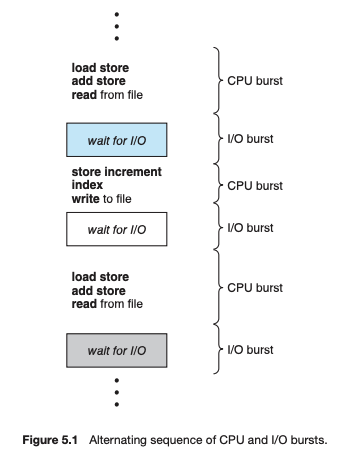
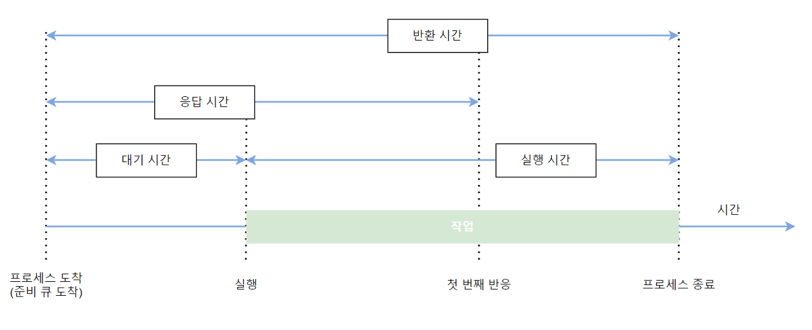

# 📌 CPU scheduling 
## 기본 개념
- single-processor system에서는 한 순간에 오직 하나의 프로세스만 실행될 수 있다.
- 나머지 프로세스들은 CPU가 free 상태가 되어, 다시 스케줄 될 수 있을 때 까지 기다려야 한다.

- `Multi-programming의 목적`은 CPU 이용률을 최대화하기 위해 `항상 실행 중인 프로세스를 갖게 하는 것`
- 이 방식에서, 어느 한 순간에 다수의 프로세스들을 메모리 내에 유지한다.
- 이후에 어떤 프로세스가 대기해야 하는 경우, 운영체제는 `CPU를 해당 프로세스로부터 회수하여 다른 프로세스에 할당`한다.

>CPU 이용률을 최대화 하는 것은 다중 프로세서 운영체제 설계의 핵심

## CPU-입출력 버스트 사이클 (CPU-I/O Burst Cycle)

>프로세스 실행은 CPU 실행(CPU Execution)과 I/O 대기(I/O wait)의 사이클로 구성된다.

- 프로세스의 실행은 CPU Burst로 시작되며 `CPU burst-I/O burst - CPU burst - ..... `순으로 순차적으로 burst가 발생한다.
- 마지막 CPU burst는 실행을 종료하기 위한 시스템 요청과 함께 끝난다.

>CPU burst : 프로그램 실행 중 CPU 연산(계산 작업)이 연속적으로 실행되는 상황 
>I/O burst : 프로그램 실행 중 I/O 장치의 입출력이 이루어지는 상황

## CPU 스케줄러(CPU Scheduler)
- `CPU가 유휴 상태`가 될 때마다, 운영체제는 `Ready Queue에 있는 프로세스 중에서 하나를 선택해 실행`해야 하며, 선택은 `CPU 스케줄러(CPU Scheduler)`에 의해 수행된다.
- CPU 스케줄러는 실행 준비가 되어 있는 메모리 내의 프로세스 중에서 선택하여, 이들 중 하나에게 CPU를 할당한다.

## CPU 스케줄링이 일어나는 경우

1. 실행 상태의 프로세스가 대기 상태로 전환되었을 경우(I/O 발생)

     (1) 입출력 요청

     (2) 사건 대기 (wait() 시스템 호출 → 자식 프로세스가 종료되기를 기다려야 함)

2. 실행 상태의 프로세스가 준비 상태로 전환되었을 경우(인터럽트 발생)

     (1) 인터럽트의 발생

     (2) 시분할 시스템에서 타임 슬라이스의 소진

3. 대기 상태의 프로세스가 준비 상태로 전환되었을 경우(I/O 종료)

     (1) 입출력의 종료

     (2) 사건의 접수 완료

4. 실행 상태의 프로세스가 종료되었을 경우

> 비선점 스케줄링(Nonpreemptive Scheduling) :  CPU가 한 프로세스에 할당되면 프로세스가 종료하거나 대기 상태로 전환해 CPU를 방출할 때까지 점유한다(1,4)
>  
> 선점 스케줄링(Preemptive Scheduling) : 시분할 시스템에서 타임 슬라이스가 소진되었거나, 인터럽트나 시스템 호출 종료시에 더 높은 우선 순위 프로세스가 발생 되었음을 알았을 때, 현 실행 프로세스로부터 강제로 CPU를 회수하는 것(2,3)

## 디스패처 (Dispatcher)
- CPU의 제어를 단기 스케줄러가 선택한 프로세스에게 주는 모듈
- 디스패처가 수행하는 작업
  - 문맥교환(Switching context)
  - 사용자 모드로 전환(Switching to user mode)
  - 프로그램을 다시 시작하기 위해 사용자 프로그램의 적절한 위치로 이동(jump)
  
>문맥 교환이 일어날 때 하나의 프로세스를 정지하고 다른 프로세스의 수행을 시작하는 데까지는 시간이 소요되는데,
이 시간을 `디스패치 지연(dispatch latency) 시간`이라고 부른다.

## 스케줄링 기준 (Scheduling Criteria)

- CPU 이용률(Utilization): 어느 기간 동안 또는 특정 SNAPSHOT에서의 CPU의 이용률.
- 처리량(Throughput): 단위 시간당 완료된 프로세스의 개수.
- 총처리 시간(Turnaround Time): 프로세스가 생성되어 작업을 마치고 종료될 때까지 걸린 시간.
- 대기 시간(Waiting Time): 대기 시간은 프로세스가 준비 큐에서 대기하면서 보낸 시간의 합.
- 응답 시간(Response Time): 하나의 Request를 제출한 후 첫 번째 Response가 나올 때까지의 시간.

>`CPU Utilization, Throughput을 최대화`  `Turaround Time, Waiting Time, Response Time을 최소화`
