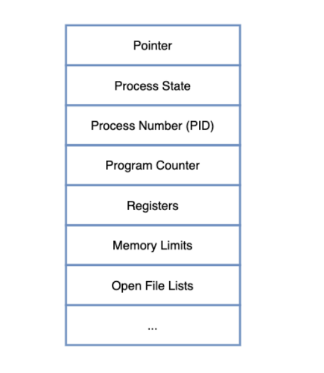
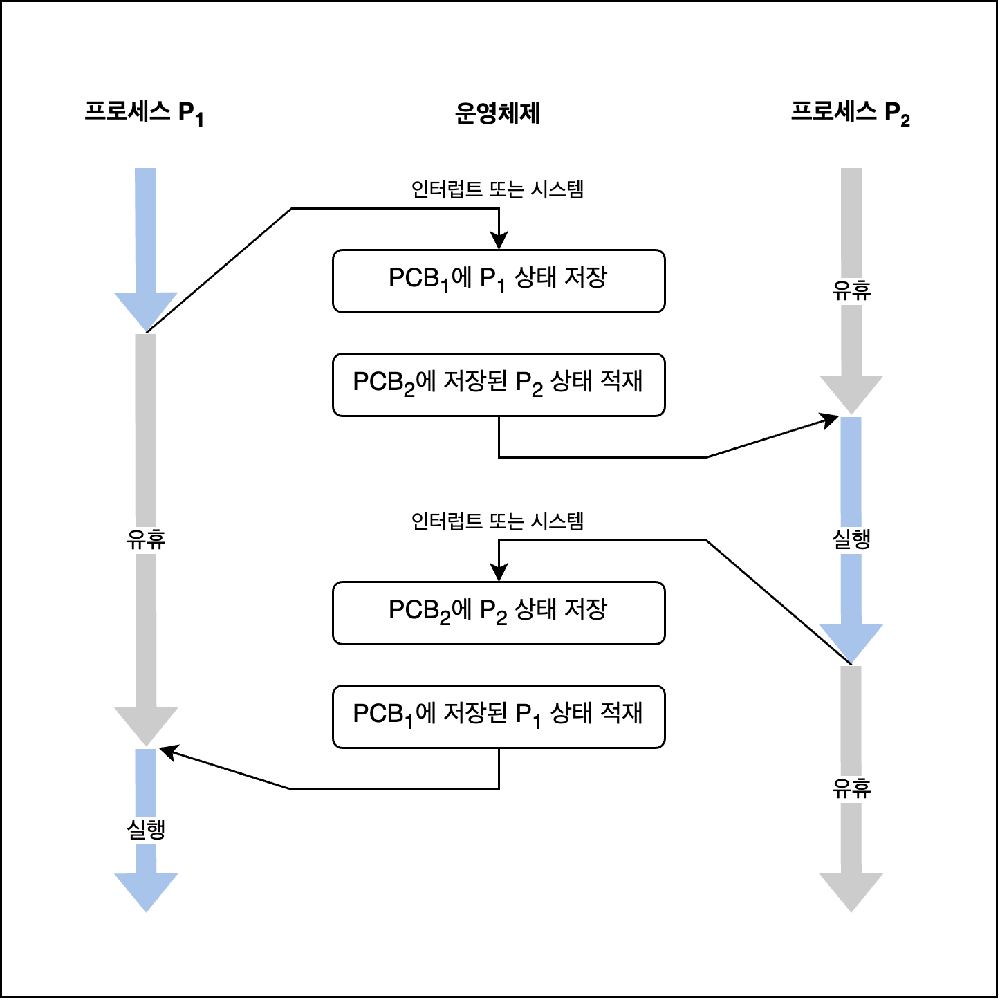

# 📌 PCB(Process Control Block)
## 💡PCB(Process Control Block)란?
- 운영체제가 프로세스를 제어하기 위해 정보를 저장해 놓는 곳, `프로세스의 상태 정보를 저장하는 구조체`
- PCB는 프로세스 생성 시 만들어지며 주기억장치에 유지된다, 프로세스가 완료되면 PCB는 제거된다.
- 프로세스의 `상태 관리`와 `문맥교환`(Context Switching)을 위해 필요하다.

## 💡PCB의 구조

### 💡PCB에 포함되는 정보
- Process ID : 프로세스의 고유 ID
- Pointer : 부모/자식 프로세스에 대한 포인터, 자원에 대한 포인터 등
- Process state : 프로세스의 상태 (Create, Ready, Running 등등)
- Program Counter : 프로세스를 위해 실행될 다음 명령어의 주소, CPU는 이 값을 참조하여 Process의 Instruction을 수행한다.
- Register : Accumulator, General Register 등을 포함하는 CPU Register의 값
- Memory Information : 해당 프로세스 주소공간(lower bound ~ upper bound) 정보를 저장
- Process Information : 페이지 테이블, 스케줄링 큐 포인터, 소유자, 부모 등
- Device I/O Status : 프로세스에 할당된 입출력 장치 목록, 열린 파일 목록 등
- Open File List : 프로세스를 위해 열려있는 파일의 리스트

 
 
 

---

# 📌 문맥교환(Context Switch)

## 💡문맥교환(Context Switch)의 개념
- 하나의 프로세스가 CPU를 사용 중인 상태에서 다른 프로세스가 CPU를 사용하도록 하기 위해, `이전 프로세스의 상태(문맥)를 보관`하고 `새로운 프로세스의 상태를 적재`하는 작업

## 💡Context Switching 필요 이유
- 여러 프로세스와 스레드들을 동시에 실행시키기 위해(그렇게 보이기 위해)
- 여러 프로세스와 스레드들이 공정하게 CPU 시간을 나눠 갖기 위해
- 높은 우선순위의 작업이 빠르게 처리될 수 있게

## 💡언제 발생하는지?

### 멀티태스킹(Multitasking)
- 여러 프로세스들이 운영체제의 스케줄러의 방식에 따라 번갈아 수행된다.
- 프로세스가 번갈아가며 CPU를 할당 받는데 이를 Context Switching이라고 한다.
- 사용자가 체감하기 힘든 속도로 Context Switching되며 프로세스가 처리되기 때문에 동시에 처리되는 것처럼 느껴진다.

### 인터럽트 핸들링(Interrupt handling)

- 인터럽트 종류
    - I/O request : 입출력 요청
    - time slice expired : CPU 사용시간이 만료
    - fork a child : 자식 프로세스 생성
    - wait for an interrupt : 인터럽트 처리 대기

> 인터럽트 : 시스템에 예외 상황이 발생했을때 CPU에게 알려 처리할 수 있도록 하는것, 인터럾트 발생 시 Context Switching이 일어난다.

### 사용자와 커널 모드 전환(User and kernel mode switching)
- user mode와 kernal mode간의 전환에서 context swtiching은 필수가 아니지만 운영체제에 따라 발생할 수 있다.

> user mode : 사용자가 응용프로그램들을 사용하기 위해 접근하는 영역이다. 또한 사용자가 프로그램 내부에 자원들에 접근할 수 없도록 하는 모드이다. 
kernal mode : system memory롸 모든 명령어들에 접근이 가능한 실행모드이다. CPU 스케줄링, 메모리 관리, I/O 관리, 파일 시스템 관리 등의 일을 맡고 있다.

## 💡문맥교환의 과정

1. Process P1이 실행되는 도중 인터럽트나 시스템 콜 발생
2. PCB1에 P1의 정보를 저장하고 PCB2의 상태를 불러온다
3. Process P2를 실행
4. P2가 실행되는 도중 인터럽트나 시스템 콜이 발생
5. PCB2에 P2의 정보를 저장하고 PCB1의 상태를 불러온다
6. Process P1을 실행

> Process P1 -> Process P2 / Process P2 -> Process P1 으로 변경되는 과정이 문맥 교환
> Context Switching이 발생하는 동안 CPU는 아무일도 하지 않는 유휴타임이 발생한다. 따라서 context switching이 너무 잦아지면 오버헤드가 발생해 성능이 떨어진다.

## 💡Context Switching Cost
Context Switching이 발생하게 되면 다음 프로세스를 위해 초기화 하는 등 여러 작업 때문에 큰 cost가 발생
- cache 초기화
- Memory Mapping 초기화
- Kernel은 메모리 접근을 위해서 항상 실행되어야 함

Context Switching 비용은 프로세스가 스레드보다 많이든다.

-> 프로세스는 공유하는 메모리가 없으므로 캐시 메모리 초기화 등의 무거운 작업을 해야 하는 반면, 스레드는 Stack 영역을 제외하면 모든 메모리를 공유하기 때문에 Context Switching 방식에서 Stack 영역만 변경 후 진행하면 되기 때문이다

>여러 프로세스에 context switching을 하지 말고, 단일 프로세스에 여러 쓰레드를 생성하여 쓰레드에서 Context Switching을 하면 된다.
쓰레드의 경우, 메모리 공간을 공유하고 있어, 스택을 정리만 하면 되기 때문에 프로세스보다 비용이 적게 든다. (정리정리)