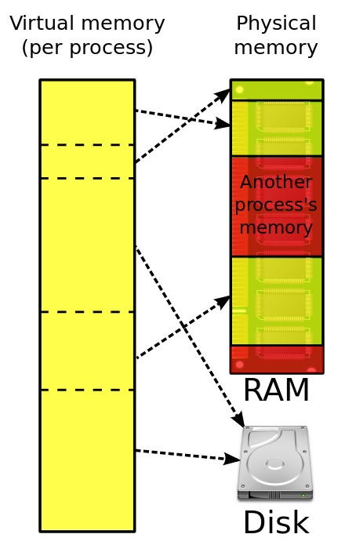

# 가상 메모리(Virtual Memory System)

## 정의

**메모리가 실제 메모리보다 많아 보이게 하는 기술**. 어떤 프로세스가 실행될 때 메모리에 해당 프로세스 전체가 올라가지 않아도 실행이 가능하다는 점에서 착안됐다.

## 원리

핵심은 **어떤 프로세스가 실행될 때 메모리에 해당 프로세스 전체가 올라가지 않더라도 실행이 가능하다는 점**이다. 이를 책상에 비유해서 이해해보자.

### 1. '책상'은 물리적으로 한정된 공간 == 물리 메모리

책상의 면적은 유한하기 때문에 면적 초과의 작업 범위를 할당할 수는 없다. 책상 위에는 **작업에 필요한 문서, 도구 등(실행 중인 프로그램 및 데이터)** 을 올려놓을 수 있으며 만약 **책상 위의 공간이 부족해지면(메모리 부족)** 작업이 어려워진다.

책상 위에서 **보고서 작성(프로세스)** 을 한다고 가정하자. 보고서의 페이지가 1000p에 육박한다고 가정할 때, 이 모든 페이지를 전부 책상에 올려두고 작업하는 것은 물리적으로 불가능하다.

### 2. 책상 하부에는 '서랍'이 존재한다 == 하드 디스크 등

서랍에는 자주 사용하지 않는 문서, 도구 등을 보관할 수 있는 것처럼 **불필요한 프로그램 및 데이터를 하드 디스크 등에 보관**할 수 있다.

이때, **작업하고 있는 해당 페이지만 책상에 올리고 남은 페이지는 전부 서랍에 넣는다(페이지 스왑).** 이렇게 되면 페이지 스왑을 통해 작업의 수월함을 꾀할 수 있지만, **서랍에서 해당 페이지를 찾는 데에 시간이 소요된다(성능 저하).** 또한, **책상의 여분 공간에는 다른 작업을 수행할 수도 있다.(멀티태스킹)**

### 3. 목차만 존재하면 전체 내용을 알 수 있다 == 가상 주소

앞서 책상에 올려진 보고서는 극히 일부고, 나머지 내용은 서랍 속에 들어서 모른다. 그렇지만, **보고서의 목차를 가지고 있으면 서랍 속의 다른 페이지의 내용을 대략적으로 파악할 수 있다(가상 주소).**

그리고 **어떤 페이지가 어느 서랍에 위치했는지를 확인하는 업무는 서랍 리스트(페이지 테이블)를 통해 확인한다.** 그리고 목차를 해석하고 실제 서랍을 찾는(실제 메모리 주소로 변환) 역할은 **운영체제**가 맡는다.

## 정리

가상 메모리를 책상에 비유했을 때의 핵심은, **책상 앞에 앉은 사용자가 책상 위의 보고서 일부 페이지를 봐도 보고서 전체에 대하여 작업을 하고 있다**는 것이다.

1. 프로그램은 가상 주소를 사용하여 메모리에 접근한다.
2. CPU는 MMU(Memory Management Unit)를 사용하여 가상 주소를 페이지 테이블에서 물리 주소로 변환한다.
3. 필요한 페이지가 물리 메모리에 있으면 CPU는 해당 페이지에 직접 접근한다.
4. 필요한 페이지가 물리 메모리에 없으면 운영 체제는 하드 디스크에서 페이지를 가져와 물리 메모리에 로드한다.
5. 로드된 페이지는 페이지 테이블에 업데이트된다.
6. CPU는 페이지 테이블에서 업데이트된 정보를 사용하여 가상 주소를 물리 주소로 변환하고 메모리에 접근한다.

*참조 링크* 
*https://ko.wikipedia.org/wiki/%EA%B0%80%EC%83%81_%EB%A9%94%EB%AA%A8%EB%A6%AC*
*https://superohinsung.tistory.com/106*